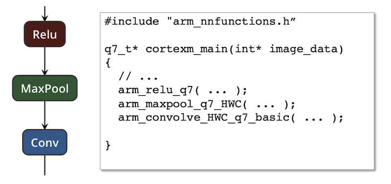
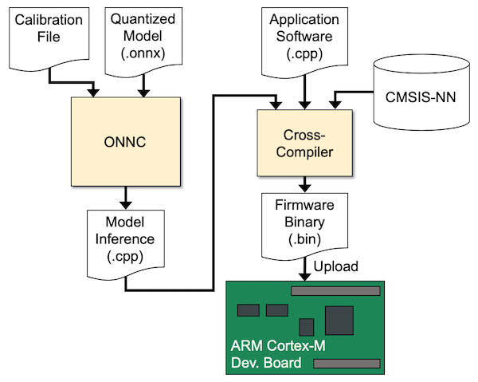
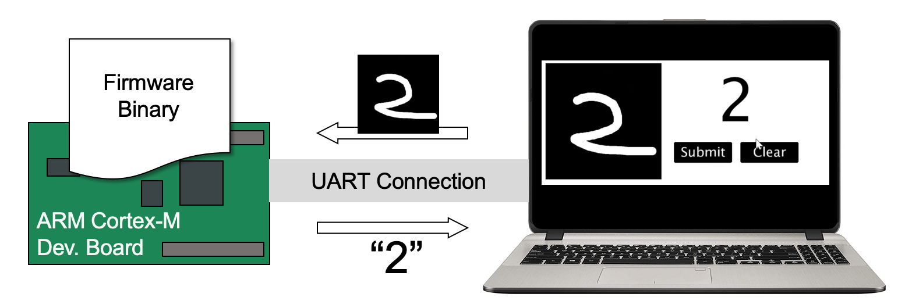
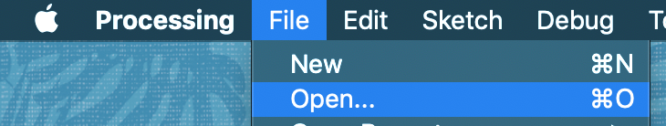
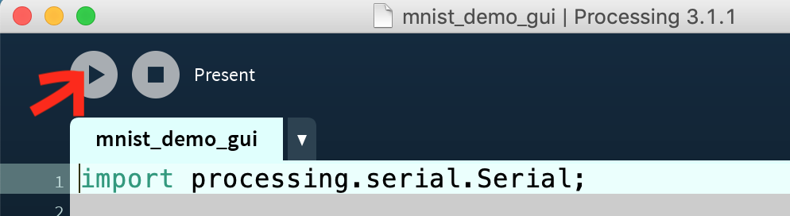
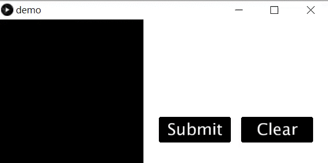

# Digit Recognition with ARM Cortex-M


## Preface

Machine learning is moving to the edge. People want to have edge computing capability on embedded devices to provide more advanced services, like voice recognition for smart speakers and face detection for surveillance cameras. The Arm Cortex-M processor family is a range of scalable, energy-efficient and easy-to-use processors that meet the needs of smart and connected embedded applications. Cortex Microcontroller Software Interface Standard (CMSIS) is a vendor-independent hardware abstraction layer for the Cortex-M processor series. Research (https://arxiv.org/abs/1801.06601) has shown that machine learning has a proven 4.6X boost on the Cortex-M platform with the new CMSIS-NN software framework. In this lab, we will introduce an ONNC backend, `CortexM` backend, for the ARM Cortex-M microprocessor and demonstrate an end-to-end application, hand-writing recognition. The CortexM backend integrates the [CMSIS-NN library](https://github.com/ARM-software/CMSIS_5) that provides a set of computing functions for several popular operators in deep neural network (DNN) models, such as convolution, maximum pooling, etc. The library is optimized for speeding up the model inference on ARM Cortex-M CPUs.  The following figure shows an example of the mapping between the model operators and the CMSIS-NN function calls.



In this lab, we will use an end-to-end application to demonstrate how the ONNC framework supports AI inferences for a target hardware easily. 

## Deploying MNIST Model Inference on an Embedded System

The following diagram depicts how we deploy MNIST model inference on an Cortex-M platform.



Typically, machine learning models are trained with floating-point data on GPU graphic cards or servers, but running inference in lower precision is preferred on embedded devices due to limited computation power. Fortunately, several research papers have proved that quantizing the data into integers can usually be performed without any loss of performance (i.e. accuracy). In this lab, we have prepared a quantized MNIST model in ONNX format. The input data and the weights are all of 8-bit integers. When running inference, the internal computation datapath might have a higher precision than 8 bits to avoid accuracy loss, but the activation data precision is converted back to 8 bits in the implementation. Many CMSIS-NN functions simply use "shift-right" logic to perform the bit-width conversion. The amount of shift-right is typically determined together with the weight quantization, so we leave it as one user input in the Cortex-M backend. The ONNX model format does not contain calibration information on the activation data. We have prepared a separate file, called the calibration file, to store the shift-right information.

After compiling the MNIST model inference application (as `.cpp` file) using ONNC, we use the ARM cross-compiler to compile and link the application and the CMSIS-NN library together. The application software depends on the underlying embedded system and the target application. Users may find hardware-dependent information from vendors. Once the firmware binary is ready, we upload the binary file into the target board by an ISP tool that should be provided by the board vendor. 

## Prerequisite

If Docker is not installed in your system, please download Docker (http://www.docker.com) and install it first. In addition, you need to install Git (https://git-scm.com/) to fetch the source code from the GitHub server. Furthermore, the demonstration uses a popular GUI programming framework, Processing, please install Processing (https://processing.org/) as well. Lastly, you need to prepare a development board equipped with ARM Cortex-M CPU. We suggest to use [Mbed compatible boards](https://os.mbed.com/platforms/) because we use the [Mbed framework](https://www.mbed.com/en/) for the firmware compilation. If your board is not compatible with Mbed, you might need to rewrite some demonstration code following the regulation from the board vendor. 

## Preparing Source Code and Docker Images

The ONNC source code for Cortex-M is available online. Use the following command to download the ONNC source code.

```sh
$ git clone -b CortexM https://github.com/ONNC/onnc.git
```

Next, use the following command to download the tutorial source code. There are some example DNN models you will use in this lab.

```sh
$ git clone https://github.com/ONNC/onnc-tutorial.git
```

Use the following command to download the application software as well as the CMSIS-NN library.

```sh
$ git clone https://github.com/ONNC/onnc-cmsis-example.git
```

Pull the Docker images from the Docker Hub using the following commands.

```sh
# Obtain the ONNC compilation environment.
$ docker pull onnc/onnc-community

# Obtain the ARM cross-compilation environment.
$ docker pull misegr/mbed-cli
```

To verify that the Docker images were downloaded successfully, use the following command to show all available Docker images. You should see both `onnc/onnc-community` and `misegr/mbed-cli` images.


```sh
$ docker images
REPOSITORY                           TAG                                IMAGE ID            CREATED             SIZE
onnc/onnc-community                  latest                             fdd06c76c519        2 days ago          5.58GB
misegr/mbed-cli                      latest                             a708c25bd4d9        2 weeks ago         2.85GB
```

## Building ONNC and Compiling Digit-Recognition Models

Use this command to bring up the ONNC-community Docker.

```sh
$ docker run -ti --rm -v <absolute/path/to/onnc>:/onnc/onnc -v <absolute/path/to/tutorial>:/tutorial onnc/onnc-community
```
Please refer to [lab 1: Environment Setup](../lab_1_Environment_Setup/lab_1.md) for Docker's command usage. Within the Docker container, use the following commands to build ONNC.

```sh
##############################################
# Within onnc/onnc-community Docker container
##############################################

$ cd /onnc/onnc-umbrella/build-normal

# Build ONNC.
$ smake -j8 install
```

Up to this point, you should have the ONNC binary ready to compile DNN models. As we have mentioned earlier, the DNN model used for this lab must have been quantized, and all of its weights are 8-bit integers. In addition, a calibration file with shift-right values on all activation data must be prepared as well. In this lab, we obtained the [mnist model](https://github.com/onnx/models/tree/master/vision/classification/mnist) from the ONNX model zoo, and performed post-training quantization to derive its quantized version. Once all files are ready (you may find a copy in the `<onnc-tutorial>/models/quantized_mnist/` folder), use the following commands to compile the model and generate C codes.

```sh
##############################################
# Within onnc/onnc-community Docker container
##############################################

# Run ONNC to compile a quantized model with calibration information.
$ onnc -mquadruple cortexm /tutorial/models/quantized_mnist/quantized_mnist.onnx \
    --load-calibration-file=/tutorial/models/quantized_mnist/mnist_calibration.txt

# Check the output files of the Cortex-M backend.
$ ls cortexm*
cortexm_main.cpp  cortexm_main.h  cortexm_weight.h

# Prepare the resulting files for the later cross-compilation.
$ sudo mv cortexm* /tutorial/models/quantized_mnist
```
By now, you may find the generated files in the `<onnc-tutorial>/models/quantized_mnist/` folder. In case where you want to exit the Docker prompt, use the following command.

```sh
##############################################
# Within onnc/onnc-community Docker container
##############################################

$ exit
```

## Cross-compilation of CortexM machine code

When you finish the previous steps of building ONNC and compiling a DNN model, you do not need the `onnc/onnc-community` Docker anymore. You need to enter the other Docker image `misegr/mbed-cli` to compile the generated C code for the Cortex-M platform. 

```sh
###############################
# Within your computer console
###############################

# Move CortexM files to the onnc-cmsis-example folder
$ cd <path/to/onnc-cmsis-example>
$ cp <path/to/tutorial>/models/quantized_mnist/cortexm* .

# Enter the cross-compilation Docker.
$ docker run -ti --rm -v <absolute/path/to/onnc-cmsis-example>:/src misegr/mbed-cli bash
```

```sh
##########################################
# Within misegr/mbed-cli Docker container
##########################################

$ cd /src
$ mbed deploy
[mbed] Working path "/src" (program)
[mbed] Adding library "mbed-os" from "https://github.com/ARMmbed/mbed-os" at rev #367dbdf5145f
[mbed] Adding library "CMSIS_5" from "https://github.com/ARM-software/CMSIS_5" at rev #c4c089d6333d
[mbed] WARNING: File "RTX_V8MMF.lib" in "/src/CMSIS_5/CMSIS/RTOS2/RTX/Library/ARM" uses a non-standard .lib file extension, which is not compatible with the mbed build tools.
...
[mbed] Auto-installing missing Python modules (fuzzywuzzy)...

# Compile the firmware for a specific target by appointing the --target option.
# Here we use NuMaker_PFM_NUC472 as an example.
# Another example is DISCO_L475VG_IOT01A by STM.
$ mbed compile --target NuMaker_PFM_NUC472
[mbed] Working path "/src" (program)
Building project src (NUMAKER_PFM_NUC472, GCC_ARM)
Scan: .
Scan: env
...
Compile [ 99.7%]: serial_api.c
Compile [ 99.9%]: spi_api.c
Compile [100.0%]: test_env.cpp
Link: src
Elf2Bin: src
+------------------+--------+-------+-------+
| Module           |  .text | .data |  .bss |
+------------------+--------+-------+-------+
| CMSIS_5/CMSIS    |   1748 |     0 |     0 |
| [fill]           |    471 |    25 |    23 |
| [lib]/c.a        |  63801 |  2548 |   127 |
| [lib]/gcc.a      |   7200 |     0 |     0 |
| [lib]/misc       |    252 |    12 |    28 |
| [lib]/nosys.a    |     32 |     0 |     0 |
| [lib]/stdc++.a   | 171534 |   165 |  5676 |
| add.o            |    192 |     4 |     1 |
| cortexm_main.o   |    384 |  6082 | 15768 |
| main.o           |    344 |     4 |  4200 |
| matmul.o         |    118 |     0 |     0 |
| mbed-os/drivers  |   1219 |     0 |     0 |
| mbed-os/features |    112 |     0 | 12345 |
| mbed-os/hal      |   1720 |     4 |    68 |
| mbed-os/platform |   3934 |   256 |   105 |
| mbed-os/rtos     |  10917 |   168 |  6073 |
| mbed-os/targets  |   5656 |   212 |   142 |
| Subtotals        | 269634 |  9480 | 44556 |
+------------------+--------+-------+-------+
Total Static RAM memory (data + bss): 54036 bytes
Total Flash memory (text + data): 279114 bytes

Image: ./BUILD/NUMAKER_PFM_NUC472/GCC_ARM/src.bin
```

The generated firmware binary file is located at <path/to/onnc-cmsis-example>/BUILD/NUMAKER_PFM_NUC472/GCC_ARM/src.bin. You can upload it to the board following the suggestion from the board vendor. The procedure is simple for an Mbed-compatible board. Connect the target board to a (Mac, Linux, or Windows) computer via a USB cable. Then you should see an Mbed drive to appear in the file browser window. Copy the `src.bin` file into that drive.

## Digit Recognition Demo

The demo setup is shown as below.



The board is connected to a PC via the UART connection. On the PC, we have prepared a GUI software where you can draw digit numbers on. Please open the [GUI program](mnist_demo_gui/mnist_demo_gui.pde) by Processing as shown in the following diagram. The file path is `<path/to/tutorial>/lab_2_Digit_Recognition_with_ARM_CortexM/mnist_demo_gui/mnist_demo_gui.pde`.



Then run the program by clicking the "run" button as below.



This demo accepts only one single-digit numnber at a time. Once you are done and click the "Submit" button on the GUI, the software will take a screenshot, transform it into a 28x28 image, and send the image to the board via the UART connection. The board will perform the model inference, and then send the classification answer back to the PC.
A screenshot of the demo is shown as below.



