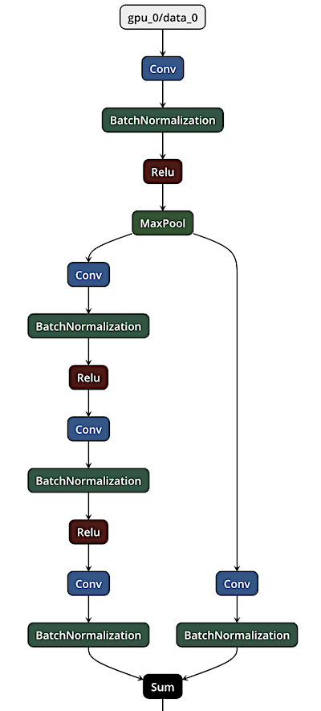
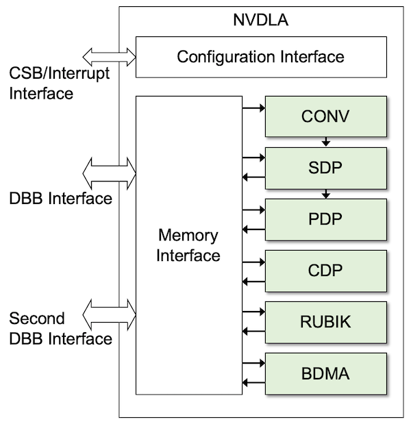
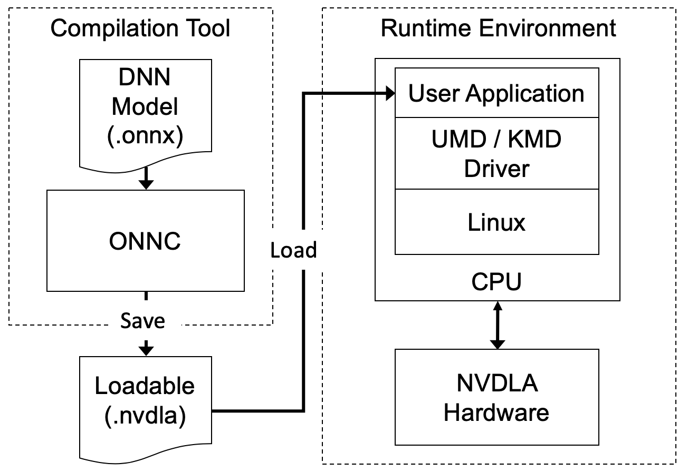
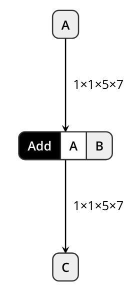
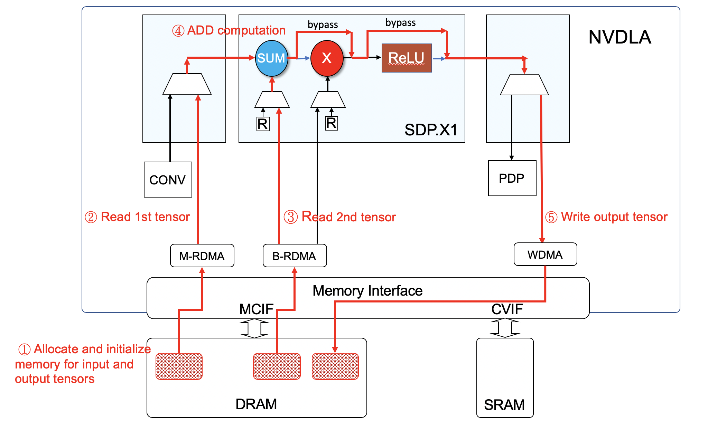

# Code Emitting

## Preface

In ONNC, hardware-dependent code is collected into backend. In the source code, you can find several backends for different hardware such as NVDLA, X86, etc. ONNC takes NNX intermediate representation (ONNX IR) as an input and produce a hardware-executable form. The following figure shows the ONNX computation graph of a partial DNN model(ResNet50). 



ONNX is an open source standard to represent the computation graph of a deep neural network. The idea of this standard is that it can serve as an intermediate representation(IR) between different deep learning runtimes. A node in the graph indicates a computation operator. An edge indicates the data dependency among operators. To implement a backend to support ONNX IR, we mainly map each operators in the graph into a sequence of hardware operations. In addition, the data dependency among operators is realized by memory allocation and data structure binding to hardware operations.

In this tutorial, we first introduce the hardware operations of NVDLA. Then we discuss and demonstrate how to implement a backend to convert the [operator of Add](https://github.com/onnx/onnx/blob/rel-1.3.0/docs/Operators.md#add) to a sequence of hardware operations.

## NVDLA Executable Form -- the Loadables

To start the implementation of a backend, we need to first understand the hardware primitives and how ONNX operators are mapped into their operations. Each hardware block in the NVDLA architecture exists to support specific operations integral to inference on deep neural networks. Inference operations are divided into five groups:

* Convolution operations (Convolution core and buffer blocks) - CONV
* Single Data Point operations (Activation engine block) - SDP
* Planar Data operations (Pooling engine block) - PDP
* Multi-Plane operations (Local resp. norm block) -CDP
* Data Memory and Reshape operations (Reshape and Bridge DMA blocks) - RUBIK, BDMA



There are four computation engines (CONV, SDP, PDP, CDP) and two data-movement engines (RUBIK, BDMA) in the above diagram. The compiler translates each operator of a given DNN model into one or more of these six hardware operations. NVDLA inference begins with the management processor (either a microcontroller or the main CPU) sending down the configuration of one hardware layer, along with an “activate” command. Once a hardware engine finishes its active task, it will issue an interrupt to the management processor to report the completion, and the management processor will then begin the process again. This command-execute-interrupt flow repeats until inference on the entire network is complete. The configurations of all hardware layers are stored in a special file called the "Loadable" file. The compiler emits Loadables and the drivers running on the management processor parses the Loadables to drive NVDLA hardware operations. The following figure shows the position of Loadable files in the NVDLA process flow.



Loadable is the result of the compilation tool and gets passed to the runtime environment. 
In the runtime environment, the user application software with UMD (User Mode Driver) embedded is running to read the Loadable file, and drive the KMD (Kernel Mode Driver) to enable the NVDLA hardware operations.

## Lab: Generating the First Loadable File with One Operator Support

In this lab, we provide a simple ONNX model that contains only one operator, [Add](https://github.com/onnx/onnx/blob/rel-1.3.0/docs/Operators.md#add), as the following figure shows.



The Operator Add is supported by NVDLA using the SDP engine. By the end of this lab, you should have implemented an NVDLA backend that generates a Loadable file for this model. In addition, you can run this Loadable in the runtime environment to see the inference result.

### Step 1: Set up environment

Please finish the following labs before continuing this lab.

* [lab 1: Environment Setup](../lab_1_Environement_Setup/lab_1.md) for preparing the Docker images and ONNC source code.
* [lab 3: Starting New Backend](../lab_3_Starting_New_Backend/lab_3.md) for preparing the experimental backend, `FooNvdla`, for the exercise in this lab.

After the preparation, you should have the backend,`FooNvdla`, ready and its code can be found in `<path/to/onnc>/lib/Target/FooNvdla`. For the rest of this lab, all the source code modification is done in the NVDLA backend, `FooNvdla`.

```bash
$ cd <path/to/onnc>/lib/Target/FooNvdla
```

### Step 2: Prepare the NVDLA backend utilities

In Lab 3, a `FooNvdla` backend is created but does not emit a Loadable for any model operators.
In this lab, we will add support for the ONNX operator, `Add`. It requires writing code to map an `Add` operator into NVDLA hardware primitives, generate configuration information for performing the operations, and emit a Loadable with all necessary information. The implementation is mostly done in a `CodeEmitVisitor::visit(Add& pOp)` function including the following main tasks:

* Allocating memory for the input and output tensors
* Creating correct configuration information in the Loadable data structures
* Creating a Loadable file and writing corresponding information into the file 

To support an operator, developers need to do the above tasks and customize them to meet the operator specification. ONNC provides many utilities and APIs to simplify the implementation process. Here is a list of utility files.

* `Loadable.cpp` - for ease of manipulating the Loadable format.
* `NvDlaDefine.cpp` - for address calculation and data type cast.
* `NvDlaFileGenPass.cpp` - for serializing the Loadable data structures into a binary file.
* `NvDlaMemInfoPass.cpp` - for calculating memory requirement for tensors.
* `NvDlaMeta.cpp` - for storing temporary information during the code emitting phase.
* `NvDlaTaskSubmitPass.cpp` - for packing Loadable blobs.
* `NvDlaUtil.cpp` for utilities used by the code emitting phase.
* `Config/NvFull.cpp` for storing the NVDLA hardware parameters.

To facilitate this lab, we have prepared a tar file that you can quickly download and get ready for this lab.

```sh
$ cd <path/to/onnc>/lib/Target
$ cp <path/to/tutorial>/lab_4_Code_Emitting/src/FooNvdla.tar.gz .
$ tar -zxvf FooNvdla.tar.gz
FooNvdla/
FooNvdla/TargetInfo/
# ...
FooNvdla/Loadable.cpp
FooNvdla/NvDlaUtil.h

$ rm FooNvdla.tar.gz
$ cd FooNvdla
```

### Step 3: Add the code emitting function for the operator `Add`

The `CodeEmitVisitor.cpp` file is designed to contain visit functions for all supported operators. A template for the `Conv` operator is included in the initial new backend creation. To implement the visit function for operator Add, we first introduce how an Add is executed on the NVDLA hardware. The execution is presented in the following figure. 



The following code snippet shows the typical programming pattern for the code emitting by using `Add` as an example. You can see that this implementation depends on several utility functions and classes, such as `NvDlaDlaOperation`, `makeCubeInfo`, `issueDlaOp`, etc. They are provided in the tar ball from Step 2. 

```cpp
// CodeEmitVisitor.cpp
#include <onnc/IR/Compute/Conv.h>
#include <onnc/IR/Compute/Add.h>

// ...

void CodeEmitVisitor::visit(const Conv& pConv)
{
}

void CodeEmitVisitor::visit(const Add& pOp)
{
  printf("visit(Add) is called\n");
  
  // Get tensor attributes.
  const Tensor& first = *(pOp.getInput(0));
  const Tensor& second = *(pOp.getInput(1));
  const Tensor& output = *(pOp.getOutput(0));

  // For this example, we only support a special case where the first tensor is activation data
  // stored in memory and the 2nd tensor is a constant
  assert( (!isConstant(first) && isConstant(second)) &&
          "support only the case that the first tensor is activation data and the second constant");

  //--------------------------------
  // Configure hardware block
  //--------------------------------

  NvDlaDlaOperation* operation = new NvDlaDlaOperation();
  // Set hardware block type.
  operation->op_dep.op_type = DLA_OP_SDP;

  struct dla_sdp_op_desc& desc = (struct dla_sdp_op_desc&)(operation->op_desc);
  desc.src_precision     = PRECISION_FP16;
  desc.dst_precision     = PRECISION_FP16;
  // No look up table is required.
  desc.lut_index         = -1;

  // For this example, we only support batch == 1.
  desc.batch_num         = 1;
  desc.batch_stride      = 0;

  // Enable X1 block.
  desc.x1_op.enable      = 1;

  // X1 operation Options: Disable (SDP_OP_NONE) / ALU only (SDP_OP_ADD) /
  //                       Multiplier only (SDP_OP_MUL) / ALU+MUL (SDP_OP_BOTH)
  desc.x1_op.type        = SDP_OP_ADD;

  // ALU type options: SUM/MIN/MAX 
  desc.x1_op.alu_type    = SDP_ALU_OP_SUM;

  // Disable ReLU
  desc.x1_op.act         = ACTIVATION_NONE;

  // Set per_layer/per_channel/per_point mode based on the broadcasting type.
  // For this example we only support per_point mode.
  desc.x1_op.mode        = SDP_OP_PER_POINT;

  // Set the datapath precision to be fp16.
  desc.x1_op.precision   = PRECISION_FP16;

  //----------------------------------------
  // Setup dataflow sources and destination
  //----------------------------------------

  struct dla_sdp_surface_desc& surface = (struct dla_sdp_surface_desc&)(operation->op_surf);

  // Setup 1st tensor source.
  const NvDlaCubeInfo firstCubeInfo   = makeCubeInfo(*this, NVDLA_CUBE_FEATURE, first);
  // The 1st input tensor can be read from:
  //   external DRAM via the interface of MCIF: DLA_MEM_MC
  //   SRAM via the interface of CVIF: DLA_MEM_CV
  //   the output of CONV hardware block: DLA_MEM_HW
  // In this example, we only support the 1st input tensor is stored at external DRAM.
  surface.src_data.type               = DLA_MEM_MC;
  // Setup memory allocation and DMA configuration for 1st input tensor.
  surface.src_data.address            = issueDlaAddr(first, firstCubeInfo);
  surface.src_data.size               = m_pMeta.getMemoryListEntrySize(first);
  surface.src_data.width              = firstCubeInfo.dim_w;
  surface.src_data.height             = firstCubeInfo.dim_h;
  surface.src_data.channel            = firstCubeInfo.dim_c;
  surface.src_data.line_stride        = firstCubeInfo.stride_line;
  surface.src_data.surf_stride        = firstCubeInfo.stride_surface;

  // Setup 2nd tensor source.
  MemoryListEntryId   memoryId;
  const NvDlaCubeInfo secondCubeInfo = makeCubeInfo(*this, getSdpXSingleCubeType(second, DLA_PRECISION), second);
  // The 2nd input tensor is stored at DRAM and accessed through the interface of MCIF.
  surface.x1_data.type               = DLA_MEM_MC;
  // Setup memory allocation and DMA configuration for 2nd input tensor.
  // In addition, the 2nd tensor is constant so need be packed into a blob and becomes a part of loadable.
  surface.x1_data.address            = issueSDPOperand(second, secondCubeInfo, memoryId);
  surface.x1_data.size               = m_pMeta.getMemoryListEntrySize(memoryId);
  surface.x1_data.width              = secondCubeInfo.dim_w;
  surface.x1_data.height             = secondCubeInfo.dim_h;
  surface.x1_data.channel            = secondCubeInfo.dim_c;
  surface.x1_data.line_stride        = secondCubeInfo.stride_line;
  surface.x1_data.surf_stride        = secondCubeInfo.stride_surface;

  // Setup output tensor destination.
  const NvDlaCubeInfo outputCubeInfo = makeCubeInfo(*this, NVDLA_CUBE_FEATURE, output);
  // The output tensor is stored at DRAM.
  surface.dst_data.type         = DLA_MEM_MC;
  surface.dst_data.address      = issueDlaAddr(output, outputCubeInfo);
  surface.dst_data.size         = m_pMeta.getMemoryListEntrySize(output);
  surface.dst_data.width        = outputCubeInfo.dim_w;
  surface.dst_data.height       = outputCubeInfo.dim_h;
  surface.dst_data.channel      = outputCubeInfo.dim_c;
  surface.dst_data.line_stride  = outputCubeInfo.stride_line;
  surface.dst_data.surf_stride  = outputCubeInfo.stride_surface;

  //----------------------------------------
  //  enlist the operation 
  //----------------------------------------
  issueDlaOp(operation, NULL, m_pMeta.m_pPrevOp);
}
```

You may find the sample code of the `CodeEmitVisitor::visit(const Add& pOp)` function in the file, [`visit_Add.cpp`](src/visit_Add.cpp). You can copy and paste it to the `CodeEmitVisitor.cpp` file. Besides the `.cpp` file, do not forget to add the declaration in the header file as below.

```diff
// CodeEmitVisitor.h
class CodeEmitVisitor : public CustomVisitor<CodeEmitVisitor>, private NvDlaConstants
{
   void visit(const Conv& pConv) override;
+  void visit(const Add& pOp) override;

   void visit(Conv& pConv) override;
+  void visit(Add& pOp) { visit(const_cast<const Add&>(pOp)); }
};
```
Lastly, you need to follow the design pattern in ONNC to register the operator in the backend.

```diff
// FooNvdlaBackend.cpp
#include <onnc/Transforms/TensorSel/Standards/ConvLower.h>
+#include <onnc/Transforms/TensorSel/Standards/AddLower.h>

void FooNvdlaBackend::RegisterLowers(LowerRegistry& pRegistry) const
{
  pRegistry.emplace<ConvLower>();
+  pRegistry.emplace<AddLower>();
}
```

### Step 4: Rebuild source code and generate the first Loadable

Since we have changed the ONNC source code, ONNC need to be rebuilt. It is recommended to rebuild ONNC within the ONNC-community Docker. Use the following command to run the ONNC-community Docker.

```bash
$ docker run -ti --rm -v <path/to/onnc>:/onnc/onnc -v <path/to/tutorial>/models:/tutorial/models onnc/onnc-community
```

Within the Docker container, use the following commands to rebuild ONNC and then utilize the new ONNC binary to compile the target DNN model.

```bash
# Within onnc/onnc-community Docker container

$ cd /onnc/onnc-umbrella/build-normal

# Rebuild ONNC.
$ smake -j8 install

# Run ONNC to compile the DNN model.
$ onnc -mquadruple foonvdla /tutorial/models/test_Add/test_Add.onnx
FooNvdla is invoked
visit(Add) is called

# Move the generated loadable file into the test directory prepared for VP to run.
$ sudo mv out.nvdla /tutorial/models/test_Add/
```

Now the Loadable file has been generated. Start another console/terminal on your computer to run the VP Docker to test the Loadable.

```bash
# Within your computer console

$ docker run -ti --rm -v <path/to/tutorial>/models:/tutorial/models onnc/vp
```

Within the VP Docker container, use the following commands to activate the virtual platform.

```bash
# Within onnc/vp Docker container

$ cd /usr/local/nvdla

# Prepare loadable, input, and golden output for the future use.
$ cp /tutorial/models/test_Add/* .

# Run the virtual platform.
$ aarch64_toplevel -c aarch64_nvdla.lua

             SystemC 2.3.0-ASI --- Oct  9 2017 04:21:14
        Copyright (c) 1996-2012 by all Contributors,
        ALL RIGHTS RESERVED

No sc_log specified, will use the default setting
verbosity_level = SC_MEDIUM
bridge: tlm2c_elaborate..
[    0.000000] Booting Linux on physical CPU 0x0

# omitted...

Initializing random number generator... done.
Starting network: udhcpc: started, v1.27.2
udhcpc: sending discover
udhcpc: sending select for 10.0.2.15
udhcpc: lease of 10.0.2.15 obtained, lease time 86400
deleting routers
adding dns 10.0.2.3
OK
Starting sshd: [    4.590433] NET: Registered protocol family 10
[    4.606182] Segment Routing with IPv6
OK

Welcome to Buildroot
nvdla login:
```


By starting the virtual platform, a Linux kernel is brought up and stops at the login prompt.

* nvdla login: root
* Password: nvdla

After logging into the Linux prompt, use the following commands to run the Loadable and get the simulation result.

```bash
# Within the virtual platform

$ mount -t 9p -o trans=virtio r /mnt && cd /mnt

# Install KMD.
$ insmod drm.ko && insmod opendla.ko
[  469.730339] opendla: loading out-of-tree module taints kernel.
[  469.734509] reset engine done
[  469.737998] [drm] Initialized nvdla 0.0.0 20171017 for 10200000.nvdla on minor 0

# Run the NVDLA runtime (containing UMD) to handle the target loadable file.
$ ./nvdla_runtime --loadable out.nvdla --image input1x5x7.pgm --rawdump
creating new runtime context...
Emulator starting
ppgminfo 1 5 7
pgm2dimg 1 5 7 1 32 160 160
submitting tasks...
[   37.512018] Enter:dla_read_network_config
[   37.513711] Exit:dla_read_network_config status=0
# ...
[   37.548723] Completed SDP operation index 0 ROI 0
[   37.549006] 1 HWLs done, totally 1 layers
# ...
[   37.551132] Exit:dla_handle_events, ret:0
[   37.553519] reset engine done
Shutdown signal received, exiting
Test pass
```

After executing nvdla_runtime, you will see a long list of messages. When you see the message, `Completed SDP operation index 0 ROI 0`, it indicates that one SDP operation has been done. Note that SDP is the main engine used to perform the Add calculation. After running the NVDLA runtime with the given Loadable file, a file called `output.dimg` is generated as the inference result. You may compare it to the golden output `test_Add.output.dimg`.

```bash
# Within the virtual platform

$ diff output.dimg test_Add.output.dimg
```

You may use the following command to exit the virtual platform.

```bash
# Within the virtual platform

$ poweroff
```
