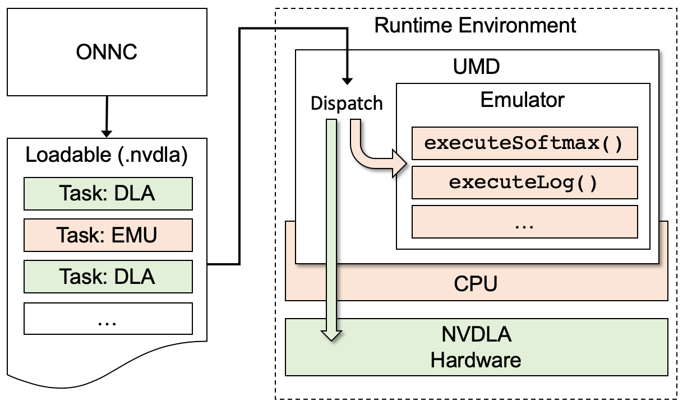
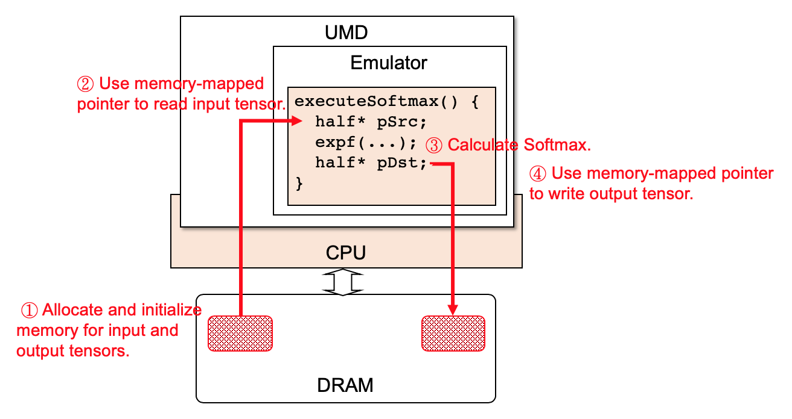

# CPU Fallback Support

## Preface

As NVDLA is considered as an inference accelerator, the CPU can be still used quite heavily for unsupported operators in the deep neural network (DNN) inference. While NVDLA is highly optimized for a subset of DNN operators that dominates inference performance, providing a fallback mechanism is inevitable for a complete set of operator support. 
In general, NVDLA has higher priority in work partition due to its superior efficiency. In the cases where it is impossible or difficult for a DNN operator to be realized by NVDLA, CPU is a slow but effective backup solution.

In this tutorial, we discuss and demonstrate how to support a DNN operator by fallback to CPU for execution in the ONNC NVDLA backend. 


## The Mechanism of CPU Fallback

CPU fallback is handled at the User Mode Driver (UMD). As the following figure shows, UMD loads a given Loadable file and then dispatches model inference tasks to either NVDLA or the CPU emulator in UMD.



`Task` is one of the data structures defined in the Loadable format. It describes how to execute model operators and the data dependency among them. There are two types of task, DLA and EMU. Since the Emulator that handles the EMU task is a part of UMD and runs on CPU, any operator dispatched to the Emulator requires a runtime function on the target CPU. So far, the official UMD provides the runtime function for two operators: Softmax and Power.

To support more CPU-fallback operators, we need to:
* Add runtime functions for those operators in the UMD Emulator.
* Modify the compiler to create EMU tasks for those operators. 

## Lab: Supporting Operators Running on the Emulator

In this lab, we will demonstrate how to implement an operator, `Softmax`, running on the emulator, and then you can implement another operator, `Log`, as an exercise. 
You may refer to the [ONNX official document](https://github.com/onnx/onnx/blob/rel-1.3.0/docs/Operators.md) for the defintion of those two operators.

### Step 1: Set up environment

Please finish the following labs first before continuing this lab.

* [lab 1: Environment Setup](../lab_1_Environement_Setup/lab_1.md) for preparing the Docker images and ONNC source codes.
* [lab 3: Starting New Backend](../lab_3_Starting_New_Backend/lab_3.md) for preparing the experimental backend `FooNvdla` for the exercise in this lab.
* [lab 4: Code Emitting](../lab_4_Code_Emitting/lab_4.md) for setting up the utilities needed by the exampled ONNX model in this lab.

After the preparation, you should have the backend,`FooNvdla`, ready and its code can be found in `<path/to/onnc>/lib/Target/FooNvdla`. For the rest of this lab, all the source code modification is done in the NVDLA backend, `FooNvdla`.

```sh
$ cd <path/to/onnc>/lib/Target/FooNvdla
```

### Step 2: Extend the Loadable data structure.

We have discussed in [lab 4: Code Emitting](../lab_4_Code_Emitting/lab_4.md) that one main task of the code emitting function for an NVDLA operator is to create correct hardware configuration information in the Loadable data structures. For example, the `Add` operator is mapped into the SDP hardware block. Similarly, for an emulator operator, the code emitting function is to map the operation into certain configuration. The emulator configuration is defined by the data structures in file `<path/to/onnc>/lib/Target/FooNvdla/include/emu_interface.h`. We need to follow the design pattern in this file to add our own configuration. In this section, we will introduce how to extend the data structure for Softmax.

We need to add three pieces of information in the file. Firstly, assign a unique number for Softmax among all EMU operators. 

```diff
// emu_interface.h

#define NVDLA_EMU_OP_POWER    0
+#define NVDLA_EMU_OP_SOFTMAX  1
```

Secondly, we add `struct emu_softmax_op_desc` to declare some variables about the configuration of Softmax. The compiler is responsible for filling values to those variables according to the given model, and the UMD Emulator takes those values for execution. Do not forget to declare the newly-added `struct emu_softmax_op_desc` inside `union emu_operation_container`, which follows the design pattern of Loadable data structure.

```diff
// emu_interface.h

struct emu_common_op_desc
{
    NvU8 op_type;
};

+struct emu_softmax_op_desc
+{
+    emu_common_op_desc common;
+    NvU8 axis;
+} __attribute__ ((packed, aligned(4)));

union emu_operation_container
{
    struct emu_power_op_desc power_op;
+    struct emu_softmax_op_desc softmax_op;
};
```

Lastly, add `struct emu_softmax_buffer_descs` to describe the dataflow of Softmax. 
Those attributes will be used for accessing the input and output tensors in memory.

```diff
// emu_interface.h

struct emu_buffer_desc
{
    /* offset to the actual IOVA in task.address_list */
    NvS16 addressIndex;
    NvU32 size;

    /* surface format */
    NvU16 format;

    /* cube dimensions */
    NvU16 width;
    NvU16 height;
    NvU16 channel;

    /* stride information */
    NvU32 line_stride;
    NvU32 surf_stride;
} __attribute__ ((packed, aligned(256)));

+struct emu_softmax_buffer_descs
+{
+    struct emu_buffer_desc src_data;
+    struct emu_buffer_desc dst_data;
+} __attribute__ ((packed, aligned(4)));

union emu_operation_buffer_container
{
    struct emu_power_buffer_descs power_buffers;
+    struct emu_softmax_buffer_descs softmax_buffers;
};
```

If you are not familiar with the design of the above data structure, we have prepared a complete implementation file, [`emu_interface.h`](src/emu_interface.h). You may copy it to overwrite the `<path/to/onnc>/lib/Target/FooNvdla/include/emu_interface.h` file.


### Step 3: Add the code emitting function for an emulator operator.

To implement the code emitting function for an emulator operator, we first introduce how an emulator operation is executed as shown by the following figure.



ONNC makes decision about whether an operator is running on NVDLA or CPU at compile time. For different decisions, the code emitting implementation is slightly different. The following code snippet shows the typical programming pattern for the code emitting function by using `Softmax` as an example. Compared to NVDLA operators, some utilities in use are different. For example, we declare a `class NvDlaEmuOperation` object for a CPU-based operator instead of a `class NvDlaDlaOperation` object. In addition, we issue a CPU-based operator by calling the utility function `issueEmuOp()` instead of `issueDlaOp()`.

```cpp
// CodeEmitVisitor.cpp

#include <onnc/IR/Compute/Conv.h>
#include <onnc/IR/Compute/Softmax.h>

// ...

void CodeEmitVisitor::visit(const Conv& pConv)
{
}

void CodeEmitVisitor::visit(const Softmax& pOp)
{
  // Get tensor attributes.
  const Tensor& input = *(pOp.getInput(0));
  const Tensor& output = *(pOp.getOutput(0));

  //--------------------------------
  // Configure emulator engine
  //--------------------------------

  // Use the class NvDlaEmuOperation here rather than class NvDlaDlaOperation the DLA counterpart.
  NvDlaEmuOperation* operation = new NvDlaEmuOperation();
  
  // Begin to fill the operator's data structure we just defined within emu_interface.h.
  struct emu_softmax_op_desc& desc = (struct emu_softmax_op_desc&)(operation->op_desc);
  desc.common.op_type = NVDLA_EMU_OP_SOFTMAX; // Assign the macro we just defined within emu_interface.h.
  desc.axis           = pOp.getAxis().value();

  //----------------------------------------
  // Setup dataflow sources and destination
  //----------------------------------------

  struct emu_softmax_buffer_descs& surface = (struct emu_softmax_buffer_descs&)(operation->op_buf);

  // Setup input tensor source.
  const NvDlaCubeInfo inputCubeInfo       = makeCubeInfo(*this, NVDLA_CUBE_FEATURE, input);
  int input_mid                           = m_pMeta.getMemoryListEntryId(input);
  surface.src_data.addressIndex           = issueEmuAddr(input_mid);
  surface.src_data.size                   = m_pMeta.getMemoryListEntrySize(input_mid);
  surface.src_data.format                 = PRECISION_FP16;
  surface.src_data.width                  = inputCubeInfo.dim_w;
  surface.src_data.height                 = inputCubeInfo.dim_h;
  surface.src_data.channel                = inputCubeInfo.dim_c;
  surface.src_data.line_stride            = inputCubeInfo.stride_line;
  surface.src_data.surf_stride            = inputCubeInfo.stride_surface;

  // Setup output tensor destination.
  const NvDlaCubeInfo outputCubeInfo = makeCubeInfo(*this, NVDLA_CUBE_FEATURE, output);
  int output_mid                = m_pMeta.getMemoryListEntryId(output);
  surface.dst_data.addressIndex = issueEmuAddr(output_mid);
  surface.dst_data.size         = m_pMeta.getMemoryListEntrySize(output_mid);
  surface.dst_data.format       = PRECISION_FP16;
  surface.dst_data.width        = outputCubeInfo.dim_w;
  surface.dst_data.height       = outputCubeInfo.dim_h;
  surface.dst_data.channel      = outputCubeInfo.dim_c;
  surface.dst_data.line_stride  = outputCubeInfo.stride_line;
  surface.dst_data.surf_stride  = outputCubeInfo.stride_surface;

  //----------------------------------------
  //  enlist the operation 
  //----------------------------------------
  // Use issueEmuOp() here rather than issueDlaOp() the DLA counterpart. 
  issueEmuOp(operation);
}
```

Next, remember to declare the newly-added visit function in the header file `CodeEmitVisitor.h` as shown below.

```diff
// CodeEmitVisitor.h
class CodeEmitVisitor : public CustomVisitor<CodeEmitVisitor>, private NvDlaConstants
{
  void visit(const Conv& pConv) override;
+  void visit(const Softmax& pOp) override;

  void visit(Conv& pConv) override;
+  void visit(Softmax& pOp) { visit(const_cast<const Softmax&>(pOp)); }
};
```

Lastly, register the `Softmax` operator in the backend.

```diff
// FooNvdlaBackend.cpp
#include <onnc/Transforms/TensorSel/Standards/ConvLower.h>
+#include <onnc/Transforms/TensorSel/Standards/SoftmaxLower.h>

void FooNvdlaBackend::RegisterLowers(LowerRegistry& pRegistry) const
{
  pRegistry.emplace<ConvLower>();
+  pRegistry.emplace<SoftmaxLower>();
}
```

### Step 4: Extend UMD Emulator to implement an execution function.

Be aware that we have implemented the support for `Power`, `Softmax`, and `Log` in the UMD within the provided VP docker image. This section describes the implementation details. The first step is to extend the Loadable data structure for `Softmax` in the UMD header file. This is similar to what we have done in Step 2 with ONNC. The extension on both ONNC and UMD must be identical so that UMD can correctly parse the loadable files from ONNC. The header file is located at `<path/to/sw>/umd/core/common/include/priv/emu/emu1/A/emu_interface.h`, where `<path/to/sw>` is the UMD/KMD source repository. You may modify this file in the same manner as what was done in Step 2.

Besides `emu_interface.h`, there are also several other data structures needed to adjust accordingly. NVIDIA implemented UMD with design patterns such as Accessor and you may follow the implementation for `Softmax` and `Power` to add supports for your own EMU operators.

In brief, these files need to be modified accordingly.

* `<path/to/sw>/umd/core/common/EMUInterface.cpp`
* `<path/to/sw>/umd/core/common/EMUInterfaceA.cpp`
* `<path/to/sw>/umd/core/common/include/priv/EMUInterface.h`
* `<path/to/sw>/umd/core/common/include/priv/EMUInterfaceEnums.h`
* `<path/to/sw>/umd/core/runtime/Emulator.cpp`
* `<path/to/sw>/umd/core/runtime/include/priv/Emulator.h`

The complete adjustments are described in [`sw.diff`](https://github.com/ONNC/onnc/blob/1.2.0/nvdla/sw.diff).

Among those adjustments, we want to highlight the Emulator modification for supporting `Softmax`.
The modification can be found at `<path/to/sw>/umd/core/runtime/Emulator.cpp` as the following code snippet shows.
You can see that `Softmax` leverages the `expf()` function in the C++ `cmath` library in its implementation.

```cpp
// Emulator.cpp

bool Emulator::processTask(NvU8* task_mem, std::vector<NvU8*> addressList)
{
  if (opType == EMUOpType::POWER) {
    executePower(power_op_desc, power_op_buffer_descs, addressList);

  } else if (opType == EMUOpType::SOFTMAX) {
    executeSoftmax(softmax_op_desc, softmax_op_buffer_descs, addressList);
    
  }
}

bool Emulator::executeSoftmax(EMUSoftmaxOpDescAccessor opDesc, 
                              EMUSoftmaxBufferDescsAccessor bufDescs, 
                              std::vector<NvU8*> addressList)
{
    EMUBufferDescAccessor src = bufDescs.srcDataAccessor();
    EMUBufferDescAccessor dst = bufDescs.dstDataAccessor();
    
    half* pSrc = reinterpret_cast<half*>(addressList[*src.addressIndex()]);
    half* pDst = reinterpret_cast<half*>(addressList[*dst.addressIndex()]);

    NvF32 maxval = -INFINITY;
    for (NvU32 ii=0; ii<*src.channel(); ii++)
    {
        if (float(pSrc[ii]) > maxval)
        {
            maxval = float(pSrc[ii]);
        }
    }
    
    // Calculate the normalization factor.
    NvF32 sumexp = 0.0f;
    for (NvU32 ii=0; ii<*src.channel(); ii++)
    {
        sumexp += expf(float(pSrc[ii])-maxval);
    }

    // Calculate the softmax value for every input element.
    for (NvU32 ii=0; ii<*src.channel(); ii++)
    {
        pDst[ii] = expf(float(pSrc[ii])-maxval) / sumexp;
    }

    // Report that the calculation is successful.
    return true;
}
```


### Step 5: Test CPU fallback on the virtual platform.

You may repeat the steps in previous sections to support the `Log` operator as an emulator operation.
Since we have changed the ONNC source code, ONNC need to be rebuilt. It is recommended to rebuild ONNC within the ONNC-community Docker. Use the following command to run the ONNC-community Docker.

```sh
$ docker run -ti --rm -v <path/to/onnc>:/onnc/onnc -v <path/to/tutorial>/models:/tutorial/models onnc/onnc-community
```
Within the Docker container, use the following commands to rebuild ONNC and then utilize the new ONNC binary to compile the target DNN model.

```sh
# Within onnc/onnc-community Docker container

$ cd /onnc/onnc-umbrella/build-normal

# Rebuild ONNC.
$ smake -j8 install

# Run ONNC to compile the DNN model.
$ onnc -mquadruple foonvdla /tutorial/models/test_Log/test_Log.onnx
FooNvdla is invoked
visit(Log) is called

# Move the generated loadable file into the test directory prepared for VP to run.
$ sudo mv out.nvdla /tutorial/models/test_Log/
```

Now the Loadable file has been generated. Start another console/terminal on your computer to run the VP Docker to test the Loadable.

```sh
# Within your computer console

$ docker run -ti --rm -v <path/to/tutorial>/models:/tutorial/models onnc/vp
```

Within the VP Docker container, use the following commands to activate the virtual platform.

```sh
# Within onnc/vp Docker container

$ cd /usr/local/nvdla

# Prepare loadable, input, and golden output for the future use.
$ cp /tutorial/models/test_Log/* .

# Run the virtual platform.
$ aarch64_toplevel -c aarch64_nvdla.lua

             SystemC 2.3.0-ASI --- Oct  9 2017 04:21:14
        Copyright (c) 1996-2012 by all Contributors,
        ALL RIGHTS RESERVED

No sc_log specified, will use the default setting
verbosity_level = SC_MEDIUM
bridge: tlm2c_elaborate..
[    0.000000] Booting Linux on physical CPU 0x0

# omitted...

Initializing random number generator... done.
Starting network: udhcpc: started, v1.27.2
udhcpc: sending discover
udhcpc: sending select for 10.0.2.15
udhcpc: lease of 10.0.2.15 obtained, lease time 86400
deleting routers
adding dns 10.0.2.3
OK
Starting sshd: [    4.590433] NET: Registered protocol family 10
[    4.606182] Segment Routing with IPv6
OK

Welcome to Buildroot
nvdla login:
```


By starting the virtual platform, a Linux kernel is brought up and stops at the login prompt.

* nvdla login: root
* Password: nvdla

After logging into the Linux prompt, use the following commands to run the Loadable and get the simulation result.

```sh
# Within the virtual platform

$ mount -t 9p -o trans=virtio r /mnt && cd /mnt

# Install KMD.
$ insmod drm.ko && insmod opendla.ko
[  469.730339] opendla: loading out-of-tree module taints kernel.
[  469.734509] reset engine done
[  469.737998] [drm] Initialized nvdla 0.0.0 20171017 for 10200000.nvdla on minor 0

# Run the NVDLA runtime (containing UMD) to handle the target loadable file.
$ ./nvdla_runtime --loadable out.nvdla --image input1x5x7.pgm --rawdump
creating new runtime context...
Emulator starting
ppgminfo 1 5 7
pgm2dimg 1 5 7 1 32 160 160
submitting tasks...
Work Found!
Work Done
Shutdown signal received, exiting
Test pass
```

After executing nvdla_runtime, you will see a long list of messages including "Work Found!" and "Work Done". It means that an EMU task is found and has been completed. You can find that those two messages are printed within the Emulator, as the following code snippet shows.

```cpp
// umd/core/runtime/Emulator.cpp

bool Emulator::run()
{
        if (!m_taskQueue.empty())
        {
            NvU8* task_mem = m_taskQueue.front();
            NvDlaDebugPrintf("Work Found!\n");
            
            // Process the task
            processTask(task_mem, mappedAddressList);
            NvDlaDebugPrintf("Work Done\n");
        }
}            
```

After running the NVDLA runtime with the given Loadable file, a file called `output.dimg` is generated as the inference result. You may compare it to the golden output `test_Log.output.dimg`.

```sh
# Within the virtual platform

$ diff output.dimg test_Log.output.dimg
```

You may use the following commnad to exit the virtual platform.

```sh
# Within the virtual platform

$ poweroff
```
