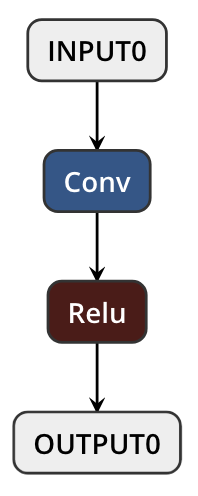
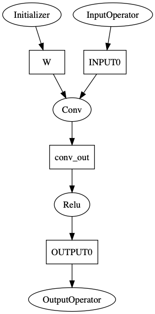
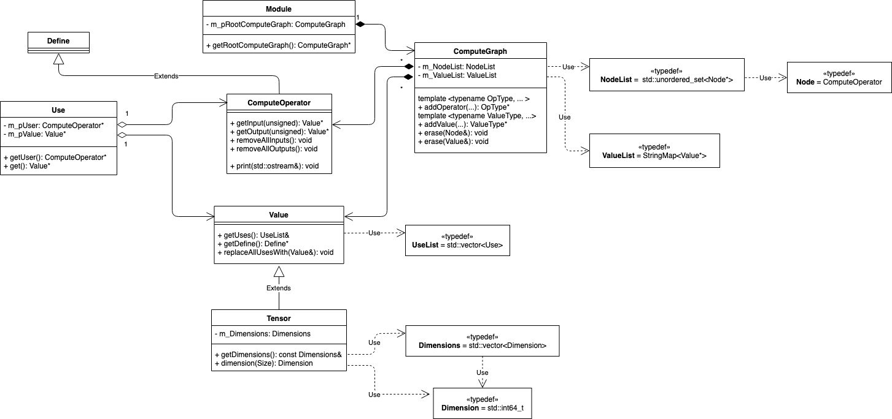
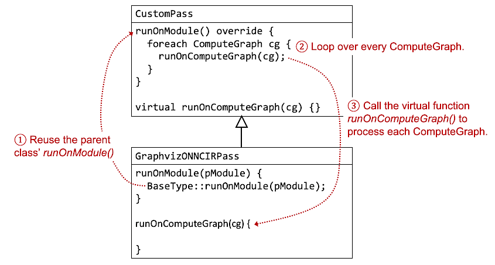

# Manipulating ONNC IR and Optimization

## Preface

ONNC inherits the concept of pass management from the LLVM infrastructure and
the pass manager is one of the most important features in ONNC as well. Any analysis or transformation on a target program can be implemented as a pass in the ONNC framework. 


The above figure depicts the top-level block diagram of ONNC software stacks. The software stack illustrates the functional blocks from importing an ONNX computation graph model to emitting a hardware-executable form. Each stack is implemented as a collection of passes. In addition to leveraging the LLVM backend, ONNC paves another fast track for proprietary DLAs to execute ONNX models by defining ONNC IR, an intermediate representation (IR) that has one-to-one mapping to the ONNX IR. The `TensorSel` pass translates the ONNX IR into the ONNC IR. The subsequent passes analyze and manipulate the ONNC IR for model optimization and transformation. Many deep learning accelerators (DLAs) have limited support for the ONNX operators and only a subset of ONNX/ONNC IRs can be directly mapped to their hardware operations. In that case, some optimization passes are designed to decompose an ONNC IR into a sequence of ONNC IRs that have direct hardware operation support. For example, in the case of NVDLA backend, a BatchNormalization operator in the ONNC IR is decomposed into a CONV followed by an ADD IR in an optimization pass before the `CodeEmit` pass. For those who intend to develop a backend, it is essential to understand the data structure and APIs for ONNC IR manipulation. In this lab, we discuss and demonstrate to write a pass of traversing the ONNC IR of a given model. 


## ONNC IR Graph

Take the following model as an example.



This model contains a CONV followed by a Relu. Its ONNC IR graph is depicted in the following diagram. 



The ONNC IR graph represents the data flow in a model. There are two types of nodes in the graph including the circle-shape nodes for compute operators and the rectangle-shape nodes for all types of values. They are implemented as C++ classes of `ComputeOperator` and `Value` respectively. In this example, there are five `ComputeOperator` in the graph. Besides `Conv` and `ReLu`, there are three other special ComputeOperators not shown in the original model. They are InputOperator, OutputOperator, and Initializer. InputOperator and OutputOperator, as the name suggests, represents the input and output of the model. Initializer is used to represent constants in the model such as weights. Between many pairs of ComputeOperators, there are rectangle-shape nodes that stores values for computation. Take the *Conv* node in the graph as an example. It has two input Values named *W* and *INPUT0*. They are kernel weights and input data respectively. It also has one output Value named *conv_out*, which is the output data of the convolution.

## Data Structures for ONNC IR

ONNC provides a group of data structures to describe the ONNC IR. The following figure shows the overview of the data structures in the UML form.



There are four major classes in the ONNC IR implementation - `class Module`, `class ComputeGraph`, `class ComputeOperator`, and `class Value`. `Class ComputeOperator` and `class Value` are already described in previous section. `Class ComputeGraph` encloses a single **connected** DAG (Directed Acyclic Graph) of ComputeOperators and Values, whereas `class Module` encloses a set of independent ComputeGraphs. Although it is rare for a DNN model to have multiple separated, disconnected data flow in reality, ONNC introduces the concept of Module in a higher and broader abstraction for extendibilitiy.  

## Lab: Visualing the ONNC IR Graph of a Given Model

In this lab, we will write a pass to traverse the ONNC IR graph of a given model and print the graph in the [Graphviz](https://www.graphviz.org/) format. Graphviz is a formal language for describing graphs and networks. There are open source software tools available to compile the textual description into some image forms such as png. The following code snippet shows an example of the Graphviz "script" and you may find the complete source file in [test_Conv_Relu.dot](src/test_Conv_Relu.dot).

```
digraph {
  ...

  Initializer_94153827516736 -> W
  InputOperator_94153828180800 -> INPUT0
  INPUT0 -> Conv_94153828038720
  W -> Conv_94153828038720
  Conv_94153828038720 -> conv_out
  conv_out -> Relu_94153827458336
  Relu_94153827458336 -> OUTPUT0
  OUTPUT0 -> OutputOperator_94153828212384
}
```

Graphviz is supported in many readers that support markdown languages and you may get the corresponding image file for the above script as the following picture.


Let's write a pass to generate the above Graphviz script in ONNC.

### Step 1: Set up environment.

Please finish the following labs first before continuing this lab.

* [lab 1: Environment Setup](../lab_1_Environment_Setup/lab_1.md) for preparing the Docker images and ONNC source codes.
* [lab 3: Starting New Backend](../lab_3_Starting_New_Backend/lab_3.md) for preparing the experimental backend `FooNvdla` for the exercise in this lab.
* [lab 4: Code Emitting](../lab_4_Code_Emitting/lab_4.md) for setting up the utilities needed by the exampled ONNX model in this lab.

After the preparation, you should have the backend of `FooNvdla` ready, and the source code file can be found in the `<path/to/onnc>/lib/Target/FooNvdla` directory.
For the rest of this lab, when we talk about modifying the source code of the NVDLA backend, we are referring to the code in the `FooNvdla` directory.

```sh
$ cd <path/to/onnc>/lib/Target/FooNvdla
```

### Step 2: Create a new pass

Pass is an abstraction of each execution in ONNC framework. It is designed for manipulating an ONNC IR graph to achieve a specific goal. Users may define customized pass types, register a pass into pass manager, and let pass manager administrate the executions.

First, create a pass by inheriting from the `CustomPass<T>` abstract class.

```cpp
// GraphvizONNCIRPass.h

#include <onnc/Core/CustomPass.h>

class GraphvizONNCIRPass : public CustomPass<GraphvizONNCIRPass>
{
public:
  GraphvizONNCIRPass() = default;

  ReturnType runOnModule(Module& pModule) override;
};
```

The `CustomPass<T>` abstract class defines several virtual functions. These member functions are invoked by the pass manager on each execution. Their prototypes are listed as below:
  
| Prototype |
| --------- |
| `virtual ReturnType doInitialization(Module&);` |
| `virtual ReturnType runOnModule(Module&);` |
| `virtual ReturnType doFinalization(Module&);` |

| Method | Description |
| ------ | ----------- |
| `doInitialization` | The first-invoked method in a pass. Acquire resources such as files, network and etc. |
| `runOnModule` | Implement module manipulations in this method. |
| `doFinalization` | The last-called method in a pass. Release resources and prepare next run. |

The above three methods are invoked exactly once per execution. Users can assemble meaningful values and return informative result to pass manager. ONNC use an enumeration type `PassResult` for execution results. 
`PassResult` is usually encoded like bit mask and the following table lists all possibile values.

| Value | Description |
| ----- | ----------- |
| `kModuleNoChanged` | No update to the module content, or do nothing. |
| `kModuleChanged` | There are some modifications on module, or invoke successfully. |
| `kPassRetry` | Can not finish invocation due to some reason. Need to retry. |
| `kPassFailure` | Failed to action. |

In the following code snippet, we show the typical implementation of the function `runOnModule`.

```cpp
// GraphvizONNCIRPass.cpp

Pass::ReturnType GraphvizONNCIRPass::runOnModule(Module& pModule)
{
  Pass::ReturnType ret = kModuleNoChanged;
  
  // ...
  // Change the value of variable `ret` if necessary.

  if (ret != kModuleNoChanged) {
    pModule.eraseUnusedValues();
  }

  return ret;
}
```

### Step 3: Implement `GraphvizONNCIRPass` to traverse the ONNC IR

In this pass, we mainly override the `runOnModule` function of GraphvizONNCIRPass, and here we utilize the ONNC framework to simplify the implementation of `runOnModule`, as the following figure shows.



The actual implementation of `runOnModule` is as follows.

```cpp
// GraphvizONNCIRPass.cpp

Pass::ReturnType GraphvizONNCIRPass::runOnModule(Module& pModule)
{
  Pass::ReturnType ret = kModuleNoChanged;

  // Call the default implementation of runOnModule(). It subsequently invokes 
  // runOnComputeGraph() to handle each of the ComputeGraphs in the module.
  ret = BaseType::runOnModule(pModule);

  if (ret != kModuleNoChanged) {
    pModule.eraseUnusedValues();
  }

  return ret;
}

// Use the following function to handle every ComputeGraph.
Pass::ReturnType GraphvizONNCIRPass::runOnComputeGraph(ComputeGraph& pCG)
{
  std::cout << "digraph {\n";

  // Traverse ComputeOperators in the topological order.
  for (ComputeOperator& op : pCG) {
    std::string opName = op.name().str() + "_" + std::to_string((long)&op);
    std::cout << "  " << opName << " [label=" << op.name() << "]\n";

    // Traverse the input of this ComputeOperator.
    int numInputs = op.getNumOfInputs();
    for (int i = 0; i < numInputs; ++i) {
      Value* input = op.getInput(i);

      std::cout << "  " << input->getName() << " -> " << opName << "\n";
    }
    
    // Traverse the output of this ComputeOperator.
    int numOutputs = op.getNumOfOutputs();
    for (int i = 0; i < numOutputs; ++i) {
      Value* output = op.getOutput(i);

      std::cout << "  " << opName << " -> " << output->getName() << "\n";
      std::cout << "  " << output->getName() << " [shape=rect]\n";
    }
  }

  std::cout << "}\n";

  // This pass does not modify the graph topology. Just returnes kModuleNoChanged.
  return Pass::kModuleNoChanged;
}
```

You may copy the complete source code of [GraphvizONNCIRPass.cpp](src/GraphvizONNCIRPass.cpp) and [GraphvizONNCIRPass.h](src/GraphvizONNCIRPass.h) from the `lab_6_anipulating_ONNC_IR/src` directory to your backend directory, `<path/to/onnc>/lib/Target/FooNvdla`.

### Step 4: Register GraphvizONNCIRPass in the target backend.

The following code snippet shows how to register `GraphvizONNCIRPass` in the FooNvdla backend.

```diff
// FooNvdlaBackend.cpp

 #include "NvDlaFileGenPass.h"
+#include "GraphvizONNCIRPass.h"

 #include <onnc/Transforms/TensorSel/Standards/ConvLower.h>
+#include <onnc/Transforms/TensorSel/Standards/ReluLower.h>

 void FooNvdlaBackend::addOnncIrOptimization(PassManager& pPM, OptimizationOptions& options)
 {
   TargetBackend::addOnncIrOptimization(pPM, options);

+  // Register the pass into the pass manager, so that it can get called during the backend's execution.
+  pPM.add<GraphvizONNCIRPass>();
 }
 
 void FooNvdlaBackend::RegisterLowers(LowerRegistry& pRegistry) const
 {
   pRegistry.emplace<ConvLower>();
+  // We need to register operator Relu because the example model in this lab contains such type of operator.
+  // Only with this registration can Relu be present in the ONNC IR.
+  pRegistry.emplace<ReluLower>();
 }
```

The complete source code of [`FooNvdlaBackend.cpp`](src/FooNvdlaBackend.cpp) is also available in the `lab_6_anipulating_ONNC_IR/src` directory 

Since we created a new file, `NvDlaFileGenPass.cpp`, for the backend, we need to declare the file addition in the building system so that it can get compiled. Modify the related cmake files as below.

```diff
// CMakeLists.txt

 add_libonnc_src(
     NvDlaMemInfoPass.cpp
     NvDlaTaskSubmitPass.cpp
     NvDlaFileGenPass.cpp
+    GraphvizONNCIRPass.cpp
```

```diff
// Makefile.am

 ONNC_TARGET_SOURCES += \
   Target/FooNvdla/NvDlaMemInfoPass.cpp \
   Target/FooNvdla/NvDlaTaskSubmitPass.cpp \
   Target/FooNvdla/NvDlaFileGenPass.cpp \
+  Target/FooNvdla/GraphvizONNCIRPass.cpp \
```

### Step 5: Re-build ONNC and check the result

Follow the instruction in lab 1 to rebuild the ONNC source code within the ONNC-community Docker.
Use the following command to bring up the ONNC-community Docker.

```sh
$ docker run -ti --rm -v <path/to/onnc>:/onnc/onnc -v <path/to/tutorial>/models:/tutorial/models onnc/onnc-community
```

Within the Docker container, use the following commands to rebuild ONNC and then use the new ONNC binary to compile the target DNN model.

```sh
# Within onnc/onnc-community Docker container

$ cd /onnc/onnc-umbrella/build-normal

# Rebuild ONNC.
$ smake -j8 install

# Run ONNC to compile the DNN model.
$ onnc -mquadruple foonvdla /tutorial/models/test_Conv_Relu/test_Conv_Relu.onnx
FooNvdla is invoked
=== GraphvizONNCIRPass ======
digraph {
  Initializer_94890678153536 [label=Initializer]
  Initializer_94890678153536 -> W
  W [shape=rect]
  InputOperator_94890678817600 [label=InputOperator]
  InputOperator_94890678817600 -> INPUT0
  INPUT0 [shape=rect]
  Conv_94890678675520 [label=Conv]
  INPUT0 -> Conv_94890678675520
  W -> Conv_94890678675520
  Conv_94890678675520 -> conv_out
  conv_out [shape=rect]
  Relu_94890678095136 [label=Relu]
  conv_out -> Relu_94890678095136
  Relu_94890678095136 -> OUTPUT0
  OUTPUT0 [shape=rect]
  OutputOperator_94890678849184 [label=OutputOperator]
  OUTPUT0 -> OutputOperator_94890678849184
}
==========================
```

Note that the number appended to each ComputeOperator is a **random** unique number such as `Initializer_94890678153536`. Since it is random, it is no surprise that your log message have different random numbers. But you may get a similar image file for your script as the following picture.


## Summary

In this lab, you have learned:

* Writing a pass, and
* How to traverse the ONNC IR graph and do something on for each `ComputeOperator` and `Value` objects. 
