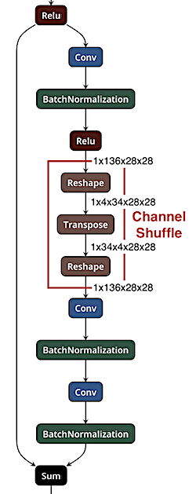
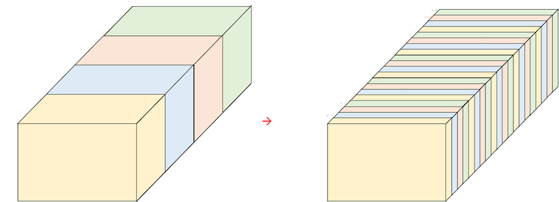
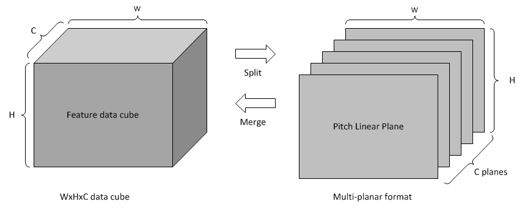
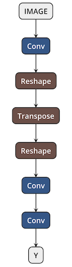
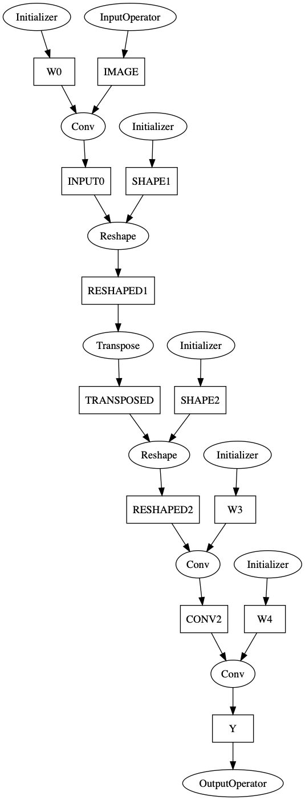
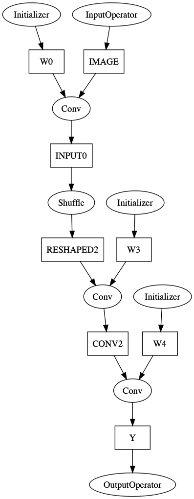
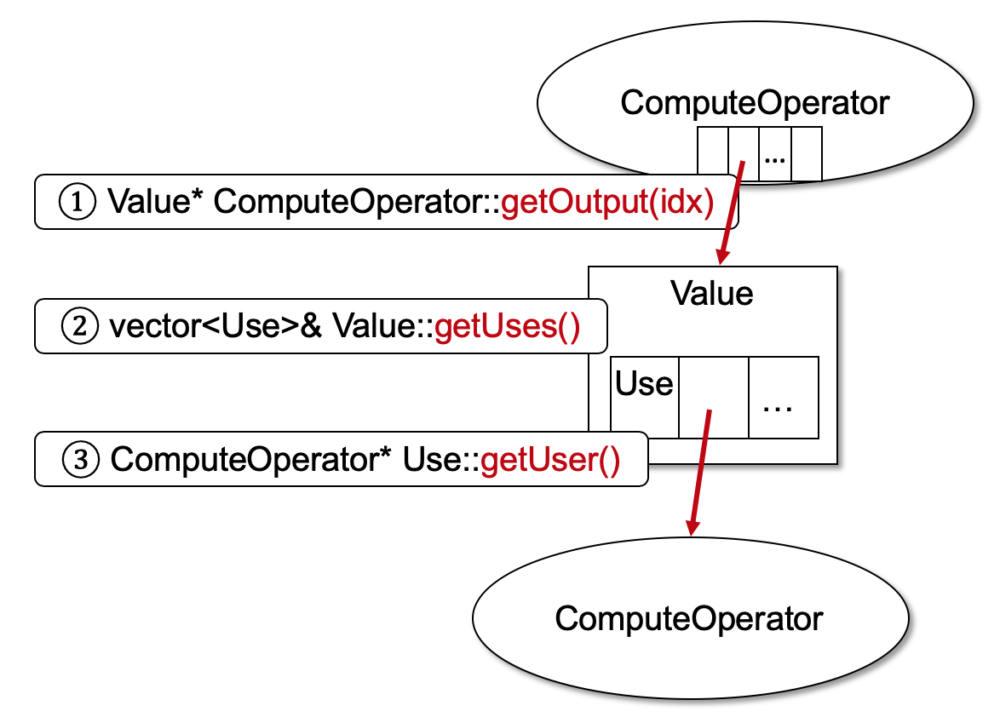
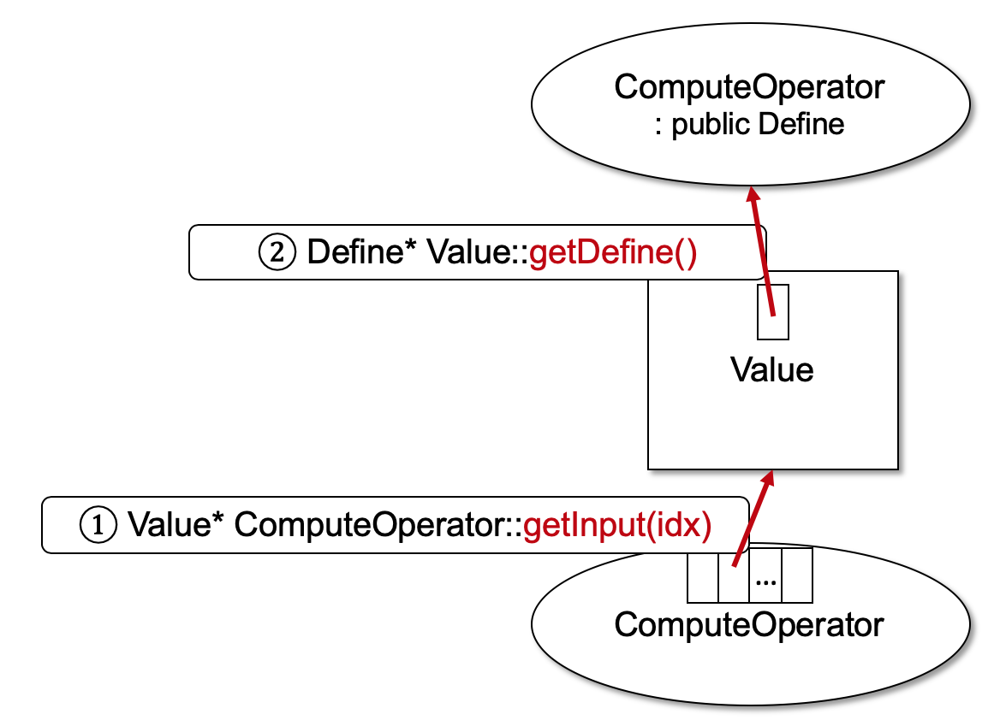

# ONNC IR Extension

## Preface

ONNC has implemented a set of ONNC IR operators in the latest release such as [Conv](https://github.com/onnx/onnx/blob/rel-1.3.0/docs/Operators.md#conv), [Relu](https://github.com/onnx/onnx/blob/rel-1.3.0/docs/Operators.md#relu), [MaxPool](https://github.com/onnx/onnx/blob/rel-1.3.0/docs/Operators.md#maxpool), etc. Many of supported operators are directly-mapped to corresponding ONNX operators. You may find each operator's description in the ONNX official site (https://github.com/onnx/onnx/blob/rel-1.3.0/docs/Operators.md). However, on some occasions, we may need additional tailor-made ONNC IR to support specific target hardware feature. An example from NVDLA is the "channel shuffle" operator, which is widely utilized by one famous image classification model, [ShuffleNet](https://arxiv.org/abs/1707.01083). The following figure shows a partial graph of ShuffleNet and there is a Reshape-Transpose-Reshape concatenation highlighted in a box.



This three-operator concatenation performs the channel suffle operation as visualized in the following figure.



The concatenated operation is equivalent to reordering the channels in an interleaved way. When mapping the Shuffle operator to the NVDLA hardware, we prefer to map three concatenated operators into a sequence of RUBIK operations in NVDLA. As the following figure (from the [NVDLA official site](http://nvdla.org/hw/v1/ias/unit_description.html#split-and-merge)) shows, the RUBIK engine provides split and merge modes to reorder memory layout. 



With a sequence of RUBIK operations, the `Shuffle` operator can be implemented in a mathematically-equivalent software pipeline. It is critical to fuse three model-layer operators into a single ONNC IR operator and the compiler gets a chance to map the operator into target hardware efficiently. This is a good example to demonstrate why we need to define proprietary IRs in some cases to support hardware-specific features. 

In this lab, we will discuss and demonstrate the method to extend the built-in ONNC IR for the hardware-specific operator, `Shuffle`, and then collapse the Reshape-Transpose-Reshape concatenation into a single `Shuffle` operator in the model description.

## Lab: Adding a Hardware-Specific Operator, `Shuffle`

The following figure shows the example model, [`test_Shuffle.onnx`](../models/test_Shuffle/test_Shuffle.onnx), used in this lab. It contains a Reshape-Transpose-Reshape concatenation that performs an `Shuffle` operation equivalently.



Given the above model, ONNC initially transforms the model into an ONNC IR graph as depicted in the following ONNC IR graph. The `Reshape` and `Transpose` operators in the given model are directly mapped to the `Reshape` and `Transpose` ONNC IRs respectively.



The goal of this lab is to demonstrate how to define a new ONNC IR and use it for an optimization pass. The optimization pass will convert the above graph to the following graph, where the Reshape-Transpose-Reshape concatenation is replaced by a single `Shuffle`.



### Step 1: Set up environment.

Please finish the following labs first before continuing this lab.

* [lab 1: Environment Setup](../lab_1_Environement_Setup/lab_1.md) for preparing the Docker images and ONNC source codes.
* [lab 3: Starting New Backend](../lab_3_Starting_New_Backend/lab_3.md) for preparing the experimental backend `FooNvdla` for the exercise in this lab.
* [lab 4: Code Emitting](../lab_4_Code_Emitting/lab_4.md) for setting up the utilities needed by this lab.

After the preparation, you should have the `FooNvdla` backend ready in `<path/to/onnc>/lib/Target/FooNvdla`.
For the rest of this lab, all code modification is made in the `FooNvdla` directory.

```sh
$ cd <path/to/onnc>/lib/Target/FooNvdla
```

### Step 2: Define a new ONNC IR operator

To define a new ONNC IR, you need to create a new IR class inheriting from the `class ComputeOperator`. In this lab, a new `class NvDlaShuffle` is declared to for the new `Shuffle` operator. There are two sets of methods and variables in this class. One set is associated with the operator attributes. For example, the `Shuffle` operator needs a variable for the attribute, "group", which indicates how to interleave the channels. The other set is mandatory and common for all operators in order to meet the ONNC framework requirement. For example, the `accept()` method is used by the [visitor design pattern](https://en.wikipedia.org/wiki/Visitor_pattern) in ONNC for performing optimization on every operator.

```cpp
// Compute/NvDlaShuffle.h

class NvDlaShuffle : public ComputeOperator
{
public:
  // This variable is mandatory for all operators. Do not omit it.
  static char ID;

public:
  NvDlaShuffle(int group)
    : ComputeOperator("Shuffle", ID) // Set "Shuffle" as the operator's type name.
    , m_Group(group) // Set the "group" attribute of this operator.
  {}

  virtual ~NvDlaShuffle() {}

  // Operator-specific methods.
  const IntAttr& getGroup() const { return m_Group; }

  // Mandatory utility methods. Do not emit them.
  Tensor* getInput(unsigned int pIdx) override { return static_cast<Tensor*>(m_Inputs[pIdx]); }
  // ...
  void printAttributes(std::ostream& pOS) const override;
  void accept(ComputeVisitor& pV) override;
  void accept(ComputeVisitor& pV) const override;
  static bool classof(const ComputeOperator* pOp);

private:
  IntAttr m_Group; // Operator-specific attribute
};
```

After the class declaration in the header file, its class implementation is shown in the following code snippet.

```cpp
// Compute/NvDlaShuffle.cpp

// Mandatory implementation. Every ONNC IR operator follows the same coding.
char NvDlaShuffle::ID = 0;

// Operator-specific implementation
void NvDlaShuffle::printAttributes(std::ostream& pOS) const
{
  pOS << "<group: " << m_Group.value() << ">";
}

// Mandatory implementation. Every ONNC IR operator follows the same coding.
void NvDlaShuffle::accept(ComputeVisitor& pV)
{
  CodeEmitVisitor* visitor = dyn_cast<CodeEmitVisitor>(&pV);
  if (nullptr != visitor)
    visitor->visit(*this);
}

// Mandatory implementation. Every ONNC IR operator follows the same coding.
void NvDlaShuffle::accept(ComputeVisitor& pV) const
{
  CodeEmitVisitor* visitor = dyn_cast<CodeEmitVisitor>(&pV);
  if (nullptr != visitor)
    visitor->visit(*this);
}

// Mandatory implementation. Every ONNC IR operator follows the same coding.
bool NvDlaShuffle::classof(const ComputeOperator* pOp)
{
  if (nullptr == pOp)
    return false;
  return (pOp->getID() == &ID);
}
```

The complete source code of [NvDlaShuffle.cpp](src/NvDlaShuffle.cpp) and [NvDlaShuffle.h](src/NvDlaShuffle.h) can be found in the lab `src` directory. Note that files related to the extended ONNC IR are conventionally located in the `Compute/` directory in a backend.  Specifically, they may be found in `<path/to/onnc>/lib/Target/FooNvdla/Compute` by default. Once the new ONNC IR class is created, we need to add its corresponding code emitting function in `CodeEmitVisitor.h` and `CodeEmitVisitor.cpp`. The code change is shown as in the following code snippet. You may refer to [lab 4: Code Emitting](../lab_4_Code_Emitting/lab_4.md) for more details.

```diff
// CodeEmitVisitor.h

 #include "NvDlaMeta.h"
+#include "Compute/NvDlaShuffle.h"

class CodeEmitVisitor : public CustomVisitor<CodeEmitVisitor>, private NvDlaConstants
{
   void visit(const Conv& pConv) override;
+  void visit(const NvDlaShuffle& pOp);

   void visit(Conv& pConv) override;
+  void visit(NvDlaShuffle& pOp) { visit(const_cast<const NvDlaShuffle&>(pOp)); }

};
```

The complete source code of [CodeEmitVisitor.cpp](src/CodeEmitVisitor.cpp) and [CodeEmitVisitor.h](src/CodeEmitVisitor.h) can be found in the `src` directory for your reference. You may copy them into `<path/to/onnc>/lib/Target/FooNvdla` directly.


### Step 3: Use the new ONNC IR to replace the matched pattern in the model

With a new ONNC IR, `Shuffle`, we will show how to write a pass to replace the Reshape-Transpose-Reshape pattern with the new `Shuffle` IR. We have elaborated on how to develop a pass and manipulate a model graph in [lab 6: Manipulating ONNC IR](../lab_6_Manipulating_ONNC_IR/lab_6.md). In this lab, we first create a pass, `class NvDlaIdentifyShufflePass`, inherited from the `class CustomPass` to search for the Reshape-Transpose-Reshape pattern.

```cpp
// NvDlaIdentifyShufflePass.h

class NvDlaIdentifyShufflePass : public CustomPass<NvDlaIdentifyShufflePass>
{
public:
  NvDlaIdentifyShufflePass() = default;

  ReturnType runOnModule(Module& pModule) override;
  
  // ...
};
```

We need to implement the `runOnModule()` function of this pass. Please refer to the file [NvDlaIdentifyShufflePass.cpp](src/NvDlaIdentifyShufflePass.cpp) for the complete source code. In the reference implementation, you may find several APIs available for traversing a model graph in this pass. In [lab 6: Manipulating ONNC IR](../lab_6_Manipulating_ONNC_IR/lab_6.md), we have introduced two classes `class ComputeOperator` and `class Value` for operators and input/output tensors respectively. To search for a specific operator concatenation pattern, we further need to know the connectivity of operators in the model graph. However, in the data structure of `ComputeOperator`, there is no variable directly pointing to other operators. 

To access another operator from a given operator, it can be done indirectly by accessing linked data structures in `ComputeOperator` and `Value`. The following figure shows how to access its downstream operators.



To get an output tensor of an operator, we first call `getOutput()` to get an output tensor and an index argument is required because an operator can have multiple outputs. `GetOutput()` returns a pointer to a `Value` object that might have multiple usages stored in an array. You may call `getUses()` to get the usage array. By retrieving a specific entry of the usage array and then calling `getUser()`, you eventually get the pointer to the target `ComputeOperator`.
For example, given an operator `op`, we can access its first downstream operator using `op.getOutput(0)->getUses()[0].getUser()`.

Similarly, if you need to access an upstream operator of a given operator, follow the instructions shown in the following figure.



You may call `getInput()` with a specific index to get the corresponding input tensor and then call `getDefine()` to get the upstream operator that produces this tensor. Note that there is no index for `getDefine()` because there exists only one upstream operator for each tensor. `GetDefine()` returns a pointer to a `Define` object. In fact, `class Define` is one of the parent class of `ComputeOperator`, so you can use `static_cast` to cast that operator as a `ComputeOperator`. For example, given an operator `op`, we can access its first upstream operator using `static_cast<ComputeOperator*>(op.getInput(0)->getDefine())`.

We have prepared the complete source code of [NvDlaIdentifyShufflePass.cpp](src/NvDlaIdentifyShufflePass.cpp) and [NvDlaIdentifyShufflePass.h](src/NvDlaIdentifyShufflePass.h) for your reference. You may copy them into `<path/to/onnc>/lib/Target/FooNvdla` if you do not want to code from scratch. Lastly, register this new pass to the pass manager to make it effective. There is an utility pass, `PrintONNCIRPass` available in the tutorial `src` directory to dump the whole ONNC IR graph in text format. We can use it to validate the optimization effect. 


```diff
// FooNvdlaBackend.cpp

 #include "NvDlaFileGenPass.h"
+#include "NvDlaIdentifyShufflePass.h"
+#include "PrintONNCIRPass.h"

@@ -74,6 +75,10 @@ void FooNvdlaBackend::addTensorSel(PassManager& pPM)
 void FooNvdlaBackend::addOnncIrOptimization(PassManager& pPM, OptimizationOptions& options)
 {
   TargetBackend::addOnncIrOptimization(pPM, options);
+
+  pPM.add<PrintONNCIRPass>();
+  pPM.add<NvDlaIdentifyShufflePass>();
+  pPM.add<PrintONNCIRPass>();
 }
 
```

You may copy [FooNvdlaBackend.cpp](src/FooNvdlaBackend.cpp), [PrintONNCIRPass.cpp](src/PrintONNCIRPass.cpp), and [PrintONNCIRPass.h](src/PrintONNCIRPass.h) from the `src` directory to `<path/to/onnc>/lib/Target/FooNvdla` to save your time. Since we created a few new files for the backend, we need to declare the file addition in the building script as follows.

```diff
// CMakeLists.txt

 add_libonnc_src(
     NvDlaMemInfoPass.cpp
     NvDlaTaskSubmitPass.cpp
     NvDlaFileGenPass.cpp
+    Compute/NvDlaShuffle.cpp
+    NvDlaIdentifyShufflePass.cpp
+    PrintONNCIRPass.cpp
```

```diff
// Makefile.am

 ONNC_TARGET_SOURCES += \
   Target/FooNvdla/NvDlaMemInfoPass.cpp \
   Target/FooNvdla/NvDlaTaskSubmitPass.cpp \
   Target/FooNvdla/NvDlaFileGenPass.cpp \
+  Target/FooNvdla/Compute/NvDlaShuffle.cpp \
+  Target/FooNvdla/NvDlaIdentifyShufflePass.cpp \
+  Target/FooNvdla/PrintONNCIRPass.cpp \
```

### Step 4: Re-build ONNC to test.

Follow the instruction in Lab 1. to rebuild the ONNC source code within the ONNC-community Docker.
Use the following command to bring up the ONNC-community Docker.

```sh
$ docker run -ti --rm -v <path/to/onnc>:/onnc/onnc -v <path/to/tutorial>/models:/tutorial/models onnc/onnc-community
```

Within the Docker container, use the following commands to rebuild ONNC and then use the new ONNC binary to compile the target DNN model.

```sh
# Within onnc/onnc-community Docker container

$ cd /onnc/onnc-umbrella/build-normal

# Rebuild ONNC.
$ smake -j8 install

# Run ONNC to compile the DNN model.
$ onnc -mquadruple foonvdla /tutorial/models/test_Shuffle/test_Shuffle.onnx
FooNvdla is invoked
=== PrintONNCIRPass ======
%W0<float>[12, 1, 1, 1] = Initializer<unimplemented>()
%SHAPE1<int64>[5] = Initializer<unimplemented>()
%SHAPE2<int64>[4] = Initializer<unimplemented>()
%W3<float>[12, 1, 1, 1] = Initializer<unimplemented>()
%W4<float>[3, 4, 1, 1] = Initializer<unimplemented>()
%IMAGE<float>[1, 1, 5, 5] = InputOperator<unimplemented>()
%INPUT0<float>[1, 12, 5, 5] = Conv<auto_pad: "NOTSET", dilations: [1, 1], group: 1, kernel_shape: [1, 1], pads: [0, 0, 0, 0], strides: [1, 1]>(%IMAGE<float>[1, 1, 5, 5], %W0<float>[12, 1, 1, 1])
%RESHAPED1<float>[1, 3, 4, 5, 5] = Reshape(%INPUT0<float>[1, 12, 5, 5], %SHAPE1<int64>[5])
%TRANSPOSED<float>[1, 4, 3, 5, 5] = Transpose<perm: [0, 2, 1, 3, 4]>(%RESHAPED1<float>[1, 3, 4, 5, 5])
%RESHAPED2<float>[1, 12, 5, 5] = Reshape(%TRANSPOSED<float>[1, 4, 3, 5, 5], %SHAPE2<int64>[4])
%CONV2<float>[1, 12, 5, 5] = Conv<auto_pad: "NOTSET", dilations: [1, 1], group: 12, kernel_shape: [1, 1], pads: [0, 0, 0, 0], strides: [1, 1]>(%RESHAPED2<float>[1, 12, 5, 5], %W3<float>[12, 1, 1, 1])
%Y<float>[1, 3, 5, 5] = Conv<auto_pad: "NOTSET", dilations: [1, 1], group: 3, kernel_shape: [1, 1], pads: [0, 0, 0, 0], strides: [1, 1]>(%CONV2<float>[1, 12, 5, 5], %W4<float>[3, 4, 1, 1])
 = OutputOperator<unimplemented>(%Y<float>[1, 3, 5, 5])
==========================
=== PrintONNCIRPass ======
%W0<float>[12, 1, 1, 1] = Initializer<unimplemented>()
%W3<float>[12, 1, 1, 1] = Initializer<unimplemented>()
%W4<float>[3, 4, 1, 1] = Initializer<unimplemented>()
%IMAGE<float>[1, 1, 5, 5] = InputOperator<unimplemented>()
%INPUT0<float>[1, 12, 5, 5] = Conv<auto_pad: "NOTSET", dilations: [1, 1], group: 1, kernel_shape: [1, 1], pads: [0, 0, 0, 0], strides: [1, 1]>(%IMAGE<float>[1, 1, 5, 5], %W0<float>[12, 1, 1, 1])
%RESHAPED2<float>[1, 12, 5, 5] = Shuffle<group: 3>(%INPUT0<float>[1, 12, 5, 5])
%CONV2<float>[1, 12, 5, 5] = Conv<auto_pad: "NOTSET", dilations: [1, 1], group: 12, kernel_shape: [1, 1], pads: [0, 0, 0, 0], strides: [1, 1]>(%RESHAPED2<float>[1, 12, 5, 5], %W3<float>[12, 1, 1, 1])
%Y<float>[1, 3, 5, 5] = Conv<auto_pad: "NOTSET", dilations: [1, 1], group: 3, kernel_shape: [1, 1], pads: [0, 0, 0, 0], strides: [1, 1]>(%CONV2<float>[1, 12, 5, 5], %W4<float>[3, 4, 1, 1])
 = OutputOperator<unimplemented>(%Y<float>[1, 3, 5, 5])
==========================
```

In the above output messages, there are two "PrintONNCIRPass" blocks. The first block prints the ONNC IR before the optimization takes effect. The IR-printing format is simply described by the following grammar rules.

```console
IRStatement:
  OutputList = IRType<AttributeList>( InputList )
  
OutputList:
  Tensor, OutputList
  
InputList:
  Tensor, InputList
  
Tensor:
  %OutputName<DataType>[DataShape]
```

We can see that there is a Reshape-Transpose-Reshape concatenation in the printout. The second block prints the ONNC IR after the optimization takes effect. Obviously, the Reshape-Transpose-Reshape concatenation disappears, and a `Shuffle` operator replaces the concatenation. With this optimization, in the code emitting phase, we can map the operator to the NVDLA RUBIK operations easily.

## Summary

In this lab, you have learned:

* Extending the built-in ONNC IR to introduce hardware-specific IR, and
* Developing a pass to translate the original model graph into the one with the new IRs.

