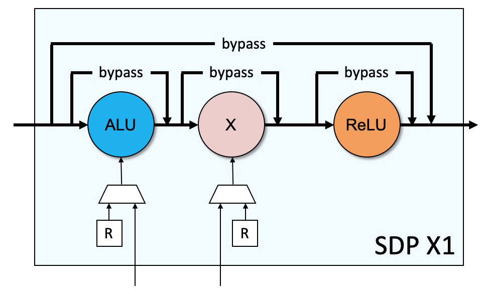
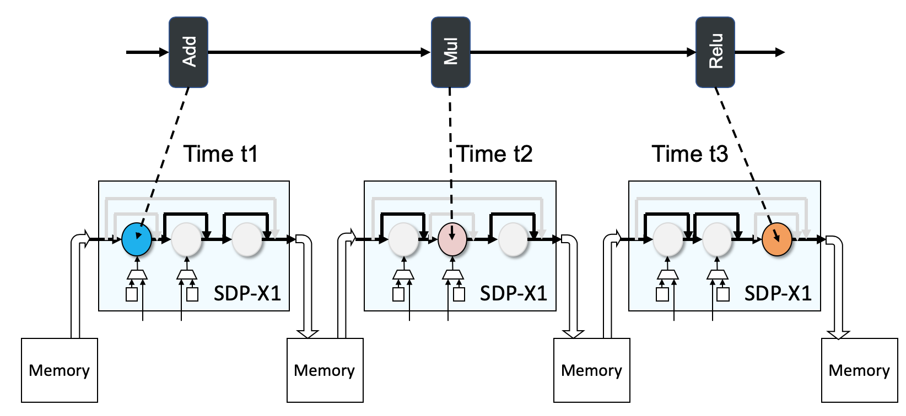
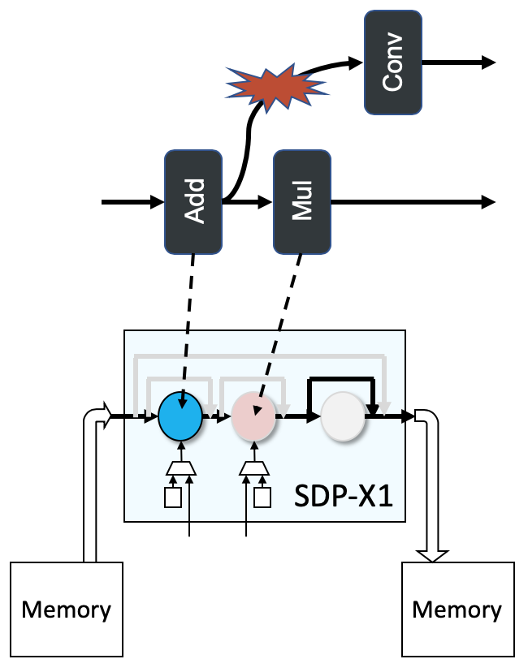
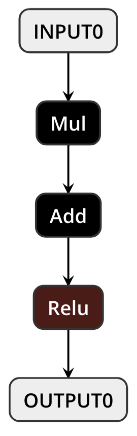
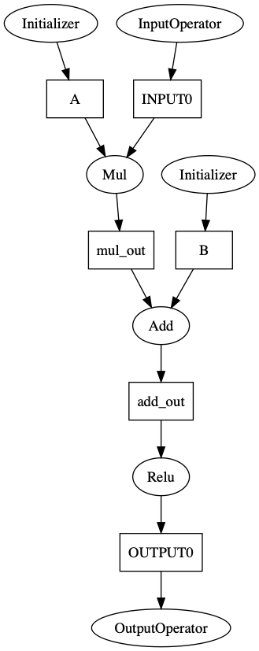
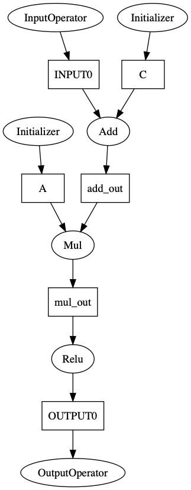
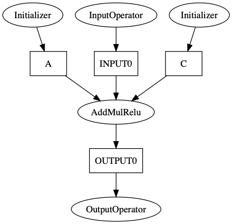

# Hardware-specific Optimization

## Preface

Many optimizations that operate on the ONNX/ONNC model IR graph are independent of the DLA hardware design, but many of the most effective optimizations are those that best exploit special features of the target platform. In the case of NVDLA, for a specific ONNX operator, there are more than one way to map the operator into a sequence of hardware operations. It is also possible that we transform a part of the model graph into another mathematically-equivalent subgraph, and then derive a better hardware execution sequence in terms of performance and power. In this tutorial, we will illustrate a hardware-specific optimization in the NVDLA backend. 

The following diagram shows one of the computation modules in NVDLA called SDP-X1.



The Single Point Data Processor (SDP) in NVDLA performs post processing operations at the single data element level. It has several function blocks and each of which targets a different purpose. The X1 block has the architecture support for Bias addition, BatchNorm, PReLU, ReLU, and Eltwise. Its datapath is composed of ALU, multiplier, and ReLU sub-blocks. Each sub-block can be programmed to be enabled or bypassed. More sub-blocks in action result in better performance. For example, if a model contains a series of Add-Mul-Relu, we prefer to map those three operators into a single SDP-X1 operation, rather than mapping them separately into three SDP-X1 operations, as the following figure shows. 



Mapping to multiple SDP-X1 operations incurs additional memory accesses, degrades performance, and consumes more power compared to mapping to a single SDP-X1. Intuitively, if we can identify a Add-Mul-ReLu pattern in a model, we can take advantage of the SDP-X1 pipeline to optimize the performance. In addition, we can transform the original model graph to create more Add-Mul-Relu patterns. For example, we can convert a Mul-Add pair to an Add-Mul pair with some adjustment in computation constants. The basic idea is that the original `Y = (X * a) + b` is mathematically equivalent to `Y = (X + c) * a`, where `c = b / a`. Note that this translation has the following pre-conditions to meet in order to be a valid conversion and executable on NVDLA hardware:

1. The result of the `Mul` operator has only one consumer.
2. The values of `a` and `b` can be determined at compile time.

The first requirement is due to the fact that the ALU output is consumed by the multiplier without any path written to the memory in the SDP-X1 pipeline. Let's look at an invalid example in the following figure.



The Add in the model violates the first condition because it has two consumers. The result of the Add operation has no way to be passed to the other consumer, Conv. Although this pattern exists in the model graph, we cannot convert the pattern for optimization. 

The second requirement comes from the fact that `c = b / a` introduces a division that has no corresponding hardware to execute. Therefore, we need the values of `a` and `b` determined in the compilation time so that the ALU input will be a single constant. It usually implies that the values of `a` and `b` are constant values in the given model.

In this lab, we will show how to implement such an optimization pass within the ONNC framework.


## Lab: Mul and Add Re-ordering and Fusion

The following figure shows the example model [test_Mul_Add_Relu.onnx](../models/test_Mul_Add_Relu/test_Mul_Add_Relu.onnx) in this lab, and it contains a Mul-Add-Relu pattern mentioned in previous section.



Given the above model, ONNC initially transforms the model into an ONNC IR graph as depicted in the following diagram.



In the ONNC IR graph, you can see that the Mul, Add, and Relu operators are ordered in the same way as in the model graph. We aim at re-ordering the Mul and Add operations as shown in the following ONNC IR graph to take advantage of SDP-X1 pipeline for better performance. 



Lastly, we will create a new compound ONNC IR AddMulRelu, and convert the Add-Mul-Relu IR sequence into a single IR so that the original three operators are considered as a whole during the code emitting phase and issued as a single SDP hardware operation.




### Step 1: Set up environment.

We recommend to finish the following labs first before continuing this lab.

* [lab 1: Environment Setup](../lab_1_Environement_Setup/lab_1.md) for preparing the Docker images and ONNC source codes.
* [lab 3: Starting New Backend](../lab_3_Starting_New_Backend/lab_3.md) for preparing the experimental backend `FooNvdla` for the exercise in this lab.
* [lab 4: Code Emitting](../lab_4_Code_Emitting/lab_4.md) for setting up the utilities needed by this lab.

The following note enables you to jump start on this lab if you forget the details of the above labs. 
It is recommended to have two terminal consoles.  One is for running the ONNC-community docker container, and the other is for running commands on your host machine.

```sh
###################################################
# Within your computer console (outside Docker container)
###################################################

# Skip these commands if you have already had the Docker images.
$ docker pull onnc/onnc-community
$ docker pull onnc/vp

# Prepare ONNC and tutorial source code.
$ git clone https://github.com/ONNC/onnc.git
$ cd onnc; git checkout tags/1.2.0; cd ..
$ git clone git@github.com:ONNC/onnc-tutorial.git

# Start the onnc/onnc-community Docker.
$ docker run -ti --rm -v <absolute/path/to/onnc>:/onnc/onnc -v <absolute/path/to/tutorial>:/tutorial onnc/onnc-community

###################################################
# Within the onnc/onnc-community Docker container.
###################################################

$ cd /onnc/onnc
$ ./scripts/create-new-backend.sh FooNvdla

###################################################
# Within your computer console (outside Docker container)
###################################################

# Install the pre-built FooNvdla backend.
$ tar -zxvf <path/to/tutorial>/lab_4_Code_Emitting/src/FooNvdla.tar.gz -C <path/to/onnc>/lib/Target

###################################################
# Within the onnc/onnc-community Docker container.
###################################################

$ cd /onnc/onnc-umbrella/build-normal
# Rebuild ONNC.
$ smake -j8 install

# Run ONNC to compile the DNN model. Make sure all the previous preparation is good.
$ onnc -mquadruple foonvdla /tutorial/models/test_group_Conv/test_group_Conv.onnx
FooNvdla is invoked
```
By now, you should have the `FooNvdla` backend ready in `<path/to/onnc>/lib/Target/FooNvdla`.
For the rest of this lab, all code modification is made in the `FooNvdla` directory.

```sh
# Within your computer console (outside Docker container)
$ cd <path/to/onnc>/lib/Target/FooNvdla
```

### Step 2: Search for the Mul-Add pattern and re-order the two operators.

The re-ordering optimization is done in a pass named NvDlaReorderMulAddPass. We have introduced how to create a pass in [lab 6: Manipulating ONNC IR](../lab_6_Manipulating_ONNC_IR/lab_6.md). You may find all the related files for this lab in the `<path/to/tutorial>/lab_8_Mul_Add_Reordering_and_Fusion/src/` directory. The implementation traverses the ONNC IR graph, finds the matched pattern, and converts the graph accordingly. The details are similar to what is done previous lab and we will skip them in this lab. 

```sh
$ cp <path/to/tutorial>/lab_8_Mul_Add_Reordering_and_Fusion/src/NvDlaReorderMulAddPass.* <path/to/onnc>/lib/Target/FooNvdla
```


### Step 3: Fuse Mul-Add-Relu into a single IR.

In this lab, we need to define a new ONNC IR, `AddMulRelu`, to represent the Mul-Add-Relu concatenation. For details, please refer to how to define a new ONNC IR operator in [lab 7: ONNC IR Extension](../lab_7_ONNC_IR_Extension/lab_7.md). 

```sh
$ mkdir -p <path/to/onnc>/lib/Target/FooNvdla/Compute

# These files are about the new IR's definition.
$ cp <path/to/tutorial>/lab_8_Mul_Add_Reordering_and_Fusion/src/NvDlaAddMulRelu.* <path/to/onnc>/lib/Target/FooNvdla/Compute

# These files are about deploying the new IR into the model graph.
$ cp <path/to/tutorial>/lab_8_Mul_Add_Reordering_and_Fusion/src/NvDlaFuseAddMulReluPass.* <path/to/onnc>/lib/Target/FooNvdla

# These files are about the code emitting functions for the new IR.
$ cp <path/to/tutorial>/lab_8_Mul_Add_Reordering_and_Fusion/src/CodeEmitVisitor.* <path/to/onnc>/lib/Target/FooNvdla
```

In addition, in order to visualize the optimization effect, we additionally introduce an utility pass "PrintONNCIRPass" to print out the ONNC IR.

```sh
$ cp <path/to/tutorial>/lab_8_Mul_Add_Reordering_and_Fusion/src/PrintONNCIRPass.* <path/to/onnc>/lib/Target/FooNvdla
```

We have introduced a few optimization passes, and remember to enable those passes in the backend.

```sh
$ cp <path/to/tutorial>/lab_8_Mul_Add_Reordering_and_Fusion/src/FooNvdlaBackend.cpp <path/to/onnc>/lib/Target/FooNvdla
```

Lastly, since we created a few new files for the backend, we need to declare the file addition in the building script so that they can get compiled. You may find the related files in the tutorial `src` directory and simply update the building scripts by the following commands.

```sh
$ cp <path/to/tutorial>/lab_8_Mul_Add_Reordering_and_Fusion/src/CMakeLists.txt <path/to/onnc>/lib/Target/FooNvdla
$ cp <path/to/tutorial>/lab_8_Mul_Add_Reordering_and_Fusion/src/Makefile.am <path/to/onnc>/lib/Target/FooNvdla
```


### Step 4: Re-build ONNC and compile the example model.

Follow the instruction in Lab 1. to rebuild the ONNC source code within the ONNC-community Docker.
Use the following command to bring up the ONNC-community Docker.

```sh
# Within onnc/onnc-community Docker container

$ cd /onnc/onnc-umbrella/build-normal

# Rebuild ONNC.
$ smake -j8 install

# Execute ONNC to compile the model.
$ onnc -mquadruple foonvdla /tutorial/models/test_Mul_Add_Relu/test_Mul_Add_Relu.onnx
FooNvdla is invoked
=== PrintONNCIRPass ======
%A<float>[1, 1, 5, 5] = Initializer<unimplemented>()
%B<float>[1, 1, 5, 5] = Initializer<unimplemented>()
%INPUT0<float>[1, 1, 5, 5] = InputOperator<unimplemented>()
%mul_out<float>[1, 1, 5, 5] = Mul(%INPUT0<float>[1, 1, 5, 5], %A<float>[1, 1, 5, 5])
%add_out<float>[1, 1, 5, 5] = Add(%mul_out<float>[1, 1, 5, 5], %B<float>[1, 1, 5, 5])
%OUTPUT0<float>[1, 1, 5, 5] = Relu(%add_out<float>[1, 1, 5, 5])
 = OutputOperator<unimplemented>(%OUTPUT0<float>[1, 1, 5, 5])
==========================
NvDlaReorderMulAddPass is called...
=== PrintONNCIRPass ======
%A<float>[1, 1, 5, 5] = Initializer<unimplemented>()
%INPUT0<float>[1, 1, 5, 5] = InputOperator<unimplemented>()
%B__gamma_0)<float>[1, 1, 5, 5] = Initializer<unimplemented>()
%add_out<float>[1, 1, 5, 5] = Add(%INPUT0<float>[1, 1, 5, 5], %B__gamma_0)<float>[1, 1, 5, 5])
%mul_out<float>[1, 1, 5, 5] = Mul(%add_out<float>[1, 1, 5, 5], %A<float>[1, 1, 5, 5])
%OUTPUT0<float>[1, 1, 5, 5] = Relu(%mul_out<float>[1, 1, 5, 5])
 = OutputOperator<unimplemented>(%OUTPUT0<float>[1, 1, 5, 5])
==========================
NvDlaFuseAddMulReluPass is called...
=== PrintONNCIRPass ======
%A<float>[1, 1, 5, 5] = Initializer<unimplemented>()
%INPUT0<float>[1, 1, 5, 5] = InputOperator<unimplemented>()
%B__gamma_0)<float>[1, 1, 5, 5] = Initializer<unimplemented>()
%OUTPUT0<float>[1, 1, 5, 5] = AddMulRelu<>(%INPUT0<float>[1, 1, 5, 5], %B__gamma_0)<float>[1, 1, 5, 5], %A<float>[1, 1, 5, 5])
 = OutputOperator<unimplemented>(%OUTPUT0<float>[1, 1, 5, 5])
==========================
visit(NvDlaAddMulRelu) is called
```

In the above output log, there are three `PrintONNCIRPass` blocks. The first one prints the initial ONNC IR graph before the re-ordering optimization takes effect. There is a Mul-Add pair in the initial graph. After `NvDlaReorderMulAddPass` is applied, the Mul-Add pair is converted to an Add-Mul pair. occurs before the Mul. In addition, one of the Add's inputs is connected to a newly-created tensor called `B__gamma_0`, which contains the adjusted coefficients. After another pass, `NvDlaFuseAddMulReluPass`, is applied, the ONNC IR graph changes again. A new ONNC IR called `AddMulRelu` replaces the Add-Mul-Relu sequence in the previous ONNC IR graph. With these optimization passes on the model graph, we can easily map three model operations into a single SDP-X1 operation in NVDLA. 

## Summary

In this lab, you have learned:

* How to fully utilize the pipelined SDP-X1 datapath by searching for the Add-Mul-Relu patterns in a given model and mapping them together into a single SDP-X1 operation.
* How to create a pass to manipulate the model graph for achieving the above optimization.

